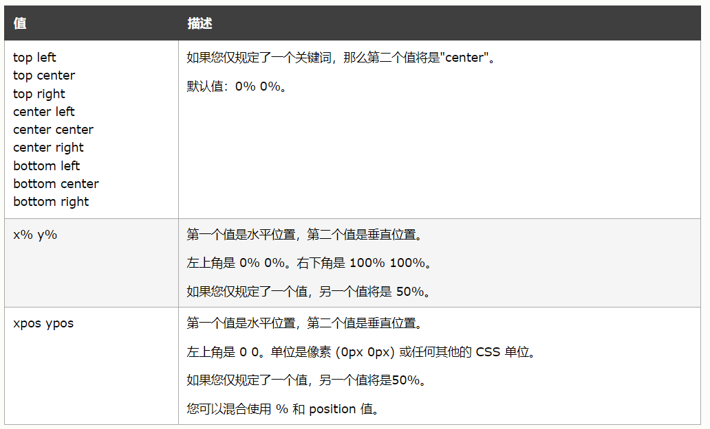
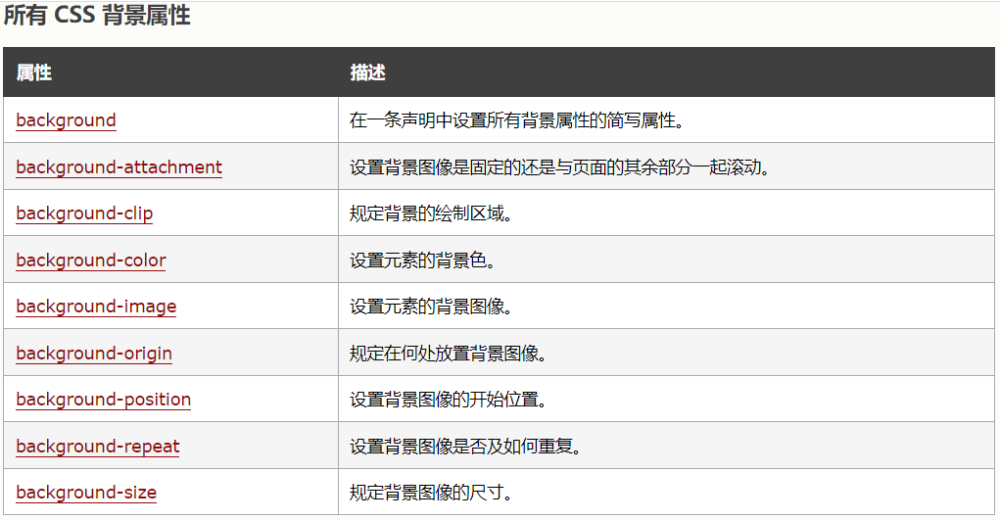
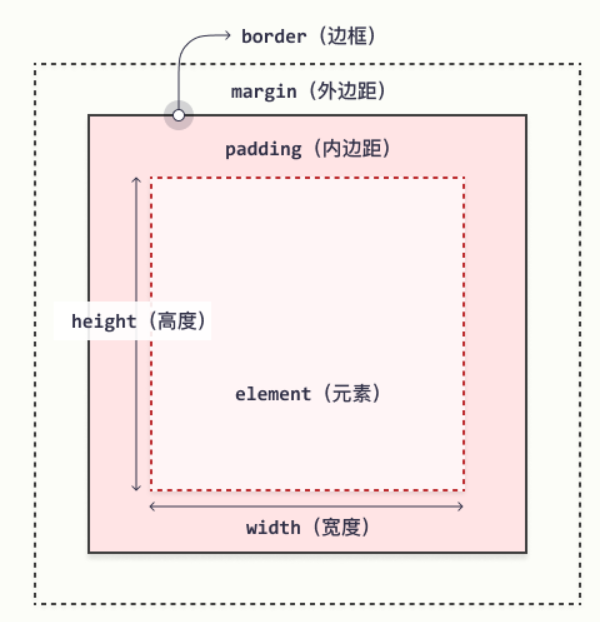
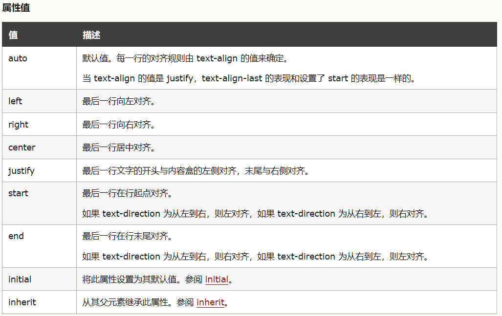
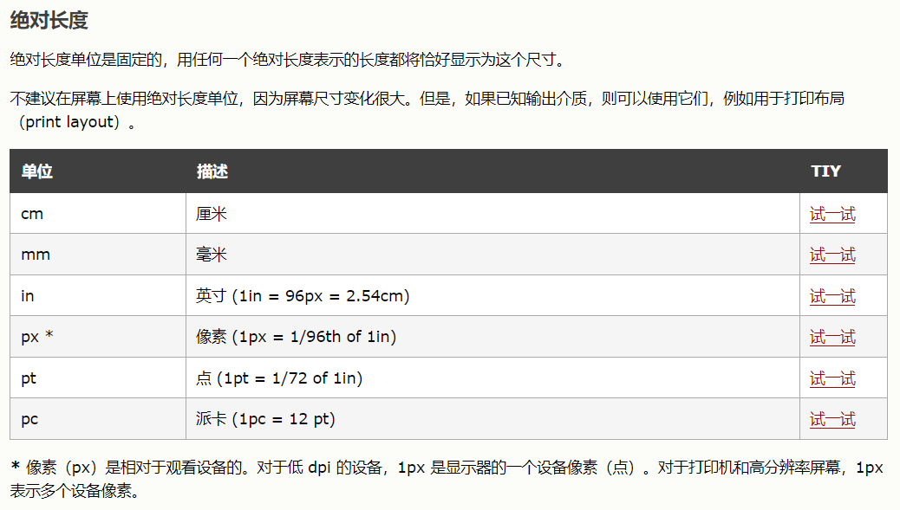
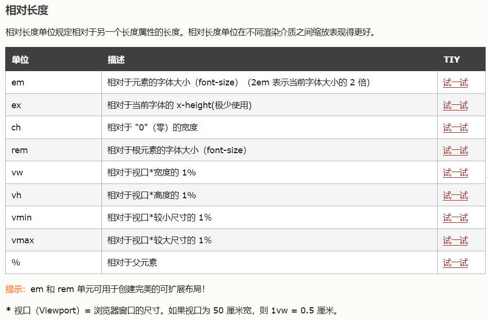

#### 外部样式表
```
<link rel="stylesheet" type="text/css" href="sheet1.css" title="default" media="all">
<link rel="alternate stylesheet" type="text/css" href="sheet1.css" title="default" media="all">
```
> - rel="stylesheet" 表示默认样式表   
> - rel="alternate stylesheet"  表示备选样式表    
> - media  表示样式表应用于哪种多媒体，如屏幕、打印机等

<br>

#### 文档样式表
```
<style type="text/css"><!--
    @import url{styles.css};
    @import url{styles2.css};
    /* 文档样式表中嵌入外部样式表 */
    h2{
    	color:gray;
    }
--></style>
```
> \<!--  \-->注释符如果浏览器中支持CSS则会忽略注释符，如果浏览器不支持CSS则会装其注释，以兼容不同的浏览器

<br>

####内联样式
```
<p style="clolr:gray;maroon;background:yellow;">Hello World!</p>
```

<br>

####选择器
- 分组选择器，样式应用在两个元素上
    + h2,p{color:gray;} 
- 通配选择器，样式应用于所有元素
    + *{color:gray;}
- 于所有的warning类名元素
    + *.warning{font-weight:bold;}
    + .warning{font-weight:bold;}
- 类选择器，应用于所有p元素warning类名元素
    + p.warning{font-weight:bold;} 
- 多类选择器，应用于所有p元素既是warning类名又是urgent类名的元素
    + p.warning.urgent{font-weight:bold;}
- ID选择器，应用于所有ID为first-para的元素
    + *#first-para{font-weight:bold;}
- 属性选择器，应用于含有class属性的h1元素
    + h1[class]{color:red;}
- 属性选择器，应用于含有class属性的所有元素
    + *[class]{color:red;}
- 属性选择器，应用于同时含有class属性和id属性的所有元素
    + h1[class][id]{color:red;}
- 属性选择器，应用于class属性为cla的h1元素
    + h1[class="cla"]{color:red;}
- 部分属性选择器，应用于class属性其中一个值为cla的h1元素
    + h1[class~="cla"]{color:red;}
- 子串匹配属性选择器，应用于foo属性值以"bar"开头的h1元素
    + h1[foo^="bar"]
    + h1[foo$="bar"]  /*子串匹配属性选择器，应用于foo属性值以"bar"结尾的h1元素*/
    + h1[foo*="bar"]  /*子串匹配属性选择器，应用于foo属性值包含"bar"的h1元素*/
    + h1[lang|="en"]  /*特定属性选择器，应用于lang属性等于en或以"en"开头的h1元素*/
- 后代选择器，应用于h1的p后代元素，无论P有多深
    + h1 p{color:gray;}
    + blockquote b,p b{color:gray;}  /*blockquote包含的b元素和p元素包含的b元素文本会变成灰色*/
- 子元素选择器，应用于h1的p子元素
    + h1 > p{color:gray;}
- 相邻兄弟选择器，应用于h1之后紧挨着的一个p元素
    + h1 + p{color:gray;}
- 兄弟选择器，应用于h1之后紧挨着的所有p元素
    + h1 ~ p{color:gary;}
- 伪类选择器
    + 链接伪类
        * a:link{color:bule;}     //未访问的超链接
        * a:visited{color:red;}   //已访问过的超链接
    + 动态伪类
        * :focus    //应用于当前获得焦点的元素
        * :hover    //应用于鼠标指针停留的元素上
        * :avtive   //指示被用户输入激活的元素
        * 伪类规则的推荐顺序：link-visited-focus-active(LoVe-HA,因为权重规则)
    + 静态伪类
        * p:first-child{color:blue;}   //选择第一个子元素，应用于做为某元素的第一个元素的p元素，即p元素是第一个元素，样式作用在p元素上
        * :fullscreen - 选择处于全屏模式的元素。
        * :lang(fr){font-style:italic;}    //根据语言选择，应用于法语元素
- 伪元素选择器
    + p:first-letter{color:red;}    //设置一个块级元素的首字母的样式，应用于p元素的第一个字母变为红色
    + p:first-line{color:red;}   //影响元素中第一个文本行，应用于p元素的第一行变为红色
    + h2:before{cotent:"()";color:red;}
    + h2:after{cotent:"()";color:red;}    //在h2元素之前或之后插入红色的小括号


|选择器|例子|例子描述|
|:---|:---|:---|
|:checked|input:checked|选择每个被选中的 <\input> 元素。|
|:disabled|input:disabled|选择每个被禁用的 <\input> 元素。|
|:empty|p:empty|选择没有子元素的每个 <p> 元素。|
|:enabled|input:enabled|选择每个已启用的 <\input> 元素。|
|:first-of-type|p:first-of-type|选择作为其父的首个 <p> 元素的每个 <p> 元素。|
|:in-range| input:in-range|选择具有指定范围内的值的 <\input> 元素。|
|:invalid|input:invalid|选择所有具有无效值的 <\input> 元素。|
|:lang(language)|p:lang(it)|选择每个 lang 属性值以 "it" 开头的 <p> 元素。|
|:last-child|p:last-child|选择作为其父的最后一个子元素的每个 <p> 元素。|
|:last-of-type|p:last-of-type|选择作为其父的最后一个 <p> 元素的每个 <p> 元素。|
|:not(selector)|:not(p)|选择每个非 <p> 元素的元素。|
|:nth-child(n)|p:nth-child(2)|选择作为其父的第二个子元素的每个 <p> 元素。|
|:nth-last-child(n)|p:nth-last-child(2)|选择作为父的第二个子元素的每个<p>元素，从最后一个子元素计数。|
|:nth-last-of-type(n)|p:nth-last-of-type(2)|选择作为父的第二个<p>元素的每个<p>元素，从最后一个子元素计数|
|:nth-of-type(n)|p:nth-of-type(2)|选择作为其父的第二个 <p> 元素的每个 <p> 元素。|
|:only-of-type|p:only-of-type|选择作为其父的唯一 <p> 元素的每个 <p> 元素。|
|:only-child|p:only-child|选择作为其父的唯一子元素的 <p> 元素。|
|:optional|input:optional|选择不带 "required" 属性的 <\input> 元素。|
|:out-of-range|input:out-of-range|选择值在指定范围之外的 <\input> 元素。|
|:read-only|input:read-only|选择指定了 "readonly" 属性的 <\input> 元素。|
|:read-write|input:read-write|选择不带 "readonly" 属性的 <\input> 元素。|
|:required|input:required|选择指定了 "required" 属性的 <\input> 元素。|
|:root|root|选择元素的根元素。|
|:target|#news:target|选择当前活动的 #news 元素（单击包含该锚名称的 URL）。|
|:valid|input:valid|选择所有具有有效值的 <\input> 元素。|
|::after|p::after|在每个 <p> 元素之后插入内容。|
|::before|p::before|在每个 <p> 元素之前插入内容。|
|::first-letter|p::first-letter|选择每个 <p> 元素的首字母。|
|::first-line|p::first-line|选择每个 <p> 元素的首行。|
|::selection|p::selection|选择用户选择的元素部分。|

<br>

####特殊性
- 对于内联样式声明，加1,0,0,0
- 对于选择器中给定的各个ID属性值，加0,1,0,0
- 对于选择器中给定的各个类属性值、属性选择或伪类，加0,0,1,0
- 对于选择器中给定的各个元素和伪元素，加0,0,0,1
- 结合符和通配选择器对特殊性没有凭借贡献
- 重要声明，如果一个重要声明和一个非重要声明冲突，胜出的总是重要声明
> h1{color:red;}                     特殊性：0,0,0,1  
> p em{color:red;}                   特殊性：0,0,0,2  
> p.bright em.dark{color:red;}       特殊性0,0,2,2  
> div#sidebar *[href]{color:red;}    特殊性0,1,1,1  
> `<h1 id="meadow" style="color:green;">The Meadow Parity</h1>`     特殊性1,0,0,0  
> h1{font-style:italic  !important;color:gray;}    //重要声明必须写在结束分号之前
> 特性性从左向右排序，如0,1,0,0大于0,0,7,1

<br>

######样式权重
1. 读者是重要声明
2. 创作人员的重要声明
3. 创作人员的正常声明
4. 读者的正常声明
5. 用户代理声明
6. 如果两个权重、来源、和特殊性完全相同，那么在样式表中后出现的一个会胜出

######颜色
|名称|描述|名称|描述|名称|描述|
|:---:|:---:|:---:|:---:|:---:|:---:|
|aqua|线绿色|fuchsia|紫红色|lime|黄绿色|
|olive|橄榄色|red|红色|white|白色|
|black|黑色|gray|灰色|maroon|褐红色|
|orange|橙色|silver|银色|yellow|黄色|
|blue|蓝色|green|绿色|navy|深蓝色|
|pruple|紫色|teal|深青色|

<br>

+ inherit:如 #divbar{color:inherit}表示divbar的颜色从其父元素的颜色继承
+ user-select 属性规定是否能选取元素的文本。
    * user-select: auto|none|text|all;
    * auto - 默认。如果浏览器允许，则可以选择文本。
    * none - 防止选取元素的文本,不允许选取文本
    * text - 文本可被用户选取。
    * all - 单击选取文本，而不是双击。

####CSS背景
+ background-color 属性指定元素的背景色
+ background-image 属性指定用作元素背景的图像。
    * body {background-image: url("paper.gif");}
+ background-repeat 属性指定背景图像重复设置
    * background-repeat: repeat-x;  水平方向重复
    * background-repeat: repeat-y;  垂直方向重复
    * background-repeat: no-repeat; 不重复显示
+ background-position 属性用于指定背景图像的位置。
    * background-position: right top;  右上角对齐
+ background-attachment 属性指定背景图像是应该滚动还是固定的（相对与屏幕是否固定）
    * background-attachment: fixed;固定背景图片
    * background-attachment: scroll;滚动背景图片
+ background-origin 属性规定 background-position 属性相对于什么位置来定位。
    * background-origin: padding-box|border-box|content-box;
+ background-position 属性设置背景图像的起始位置。
    * 
+ background-size 属性规定背景图像的尺寸。
    * background-size: length|percentage|cover|contain;
+ 
```
#example1 {
  background-image: url(/i/photo/flower.gif), url(/i/paper.jpg);   /*两张背景图片重叠*/
  background-position: right bottom, left top;    /*以逗号分隔，各自设置背景图片的位置*/
  background-repeat: no-repeat, repeat;  /*以逗号分隔，各自设置背景图片的放置方式*/
  padding: 15px;
}
```

<br>

####CSS 边框
+ border-style 属性指定要显示的边框类型。
    * dotted - 定义点线边框
    * dashed - 定义虚线边框
    * solid - 定义实线边框
    * double - 定义双边框
    * groove - 定义 3D 坡口边框。效果取决于 border-color 值
    * ridge - 定义 3D 脊线边框。效果取决于 border-color 值
    * inset - 定义 3D inset 边框。效果取决于 border-color 值
    * outset - 定义 3D outset 边框。效果取决于 border-color 值
    * none - 定义无边框
    * hidden - 定义隐藏边框
    * p.mix {border-style: dotted dashed solid double;}可以设置一到四个值（用于上边框、右边框、下边框和左边框）
+ border-width 属性指定四个边框的宽度。
    * border-width: 25px 10px 4px 35px; /* 上边框 25px，右边框 10px，下边框 4px，左边框 35px */
+ border-color 属性用于设置四个边框的颜色。
    * border-color: red green blue yellow; /* 上红、右绿、下蓝、左黄 */
+ border: 5px solid red;属性简写
+ border-radius 属性用于向元素添加圆角边框
    * border-radius: 5px;
    * border-radius: 50px / 15px;  椭圆角
    * border-top-left-radius
    * border-top-right-radius
    * border-bottom-right-radius
    * border-bottom-left-radius
+ box-sizing 属性允许您以特定的方式定义匹配某个区域的特定元素。(将多个元素组合一起加总边框)
    * content-box - 宽度和高度分别应用到元素的内容框。在宽度和高度之外绘制元素的内边距和边框。
    * border-box - 为元素设定的宽度和高度决定了元素的边框盒。就是说，为元素指定的任何内边距和边框都将在已设定的宽度和高度内进行绘制。通过从已设定的宽度和高度分别减去边框和内边距才能得到内容的宽度和高度。
+ border-image 设置图像用作围绕元素的边框。
    * border: 10px solid transparent;padding: 15px;border-image: url(border.png) 30 round;
        - 30表示四边留30px，round表示平铺，repeat表示重复，stretch默认拉伸
        - border-image-source - 规定用作边框的图像的路径。
        - border-image-slice - 规定如何裁切边框图像。
        - border-image-width -  规定边框图像的宽度。
        - border-image-outset - 规定边框图像区域超出边框盒的量。
        - border-image-repeat - 规定边框图像应重复、圆角、还是拉伸。

<br>

####CSS 外边距
+ margin-top: 100px;
+ margin-bottom: 100px;
+ margin-right: 150px;
+ margin-left: 80px;
+ margin: 25px 50px 75px 100px;简写(上、右、下、左)
+ margin: auto;使元素在其容器中水平居中
+ margin-left: inherit;元素的左外边距继承自父元素
####CSS 内边距
+ padding-top
+ padding-right
+ padding-bottom
+ padding-left
+ padding: 25px 50px 75px 100px;简写(上、右、下、左)

<br>

####CSS 高度和宽度
+ height 和 width 属性用于设置元素的高度和宽度。
    * auto - 默认。浏览器计算高度和宽度。
    * length - 以 px、cm 等定义高度/宽度。
    * % - 以包含块的百分比定义高度/宽度。
    * initial - 将高度/宽度设置为默认值。
    * inherit - 从其父值继承高度/宽度。
    * height 和 width 属性不包括内边距、边框或外边距！它们设置的是元素的内边距、边框和外边距内的区域的高度/宽度！
+ max-width 属性用于设置元素的最大宽度。
+ 盒模型

<br>

####CSS 轮廓
> 轮廓与边框不同！不同之处在于：轮廓是在元素边框之外绘制的，并且可能与其他内容重叠。同样，轮廓也不是元素尺寸的一部分；元素的总宽度和高度不受轮廓线宽度的影响。  

+ outline-style 属性指定轮廓的样式
    * dotted - 定义点状的轮廓。
    * dashed - 定义虚线的轮廓。
    * solid - 定义实线的轮廓。
    * double - 定义双线的轮廓。
    * groove - 定义 3D 凹槽轮廓。
    * ridge - 定义 3D 凸槽轮廓。
    * inset - 定义 3D 凹边轮廓。
    * outset - 定义 3D 凸边轮廓。
    * none - 定义无轮廓。
    * hidden - 定义隐藏的轮廓。
+ outline-width 属性指定轮廓的宽度
    * thin（通常为 1px）
    * medium（通常为 3px）
    * thick （通常为 5px）
    * 特定尺寸（以 px、pt、cm、em 计）
+ outline-color 属性用于设置轮廓的颜色。
+ p.ex3 {outline: 5px solid yellow;} 属性用于设置轮廓的颜色(简写)
+ outline-offset 属性在元素的轮廓与边框之间添加空间。元素及其轮廓之间的空间是透明的。

<br>

####CSS 文本
#####文本对齐
+ text-align 属性用于设置文本的水平对齐方式。
    * text-align: center - 居中对齐
    * text-align: left; - 右对齐
    * text-align: right; - 左对齐
    * text-align: justify; - 左右对齐
+ direction 和 unicode-bidi 属性可用于更改元素的文本方向
    * direction: rtl; unicode-bidi: bidi-override; - 文本从右往左读
    * unicode-bidi: normal|embed|bidi-override|isolat|initial|inherit;
        - normal - 默认值。元素不会打开额外的嵌入级别。
        - embed - 对于行内元素，此值将打开额外的嵌入级别。
        - bidi-override - 对于行内元素，该值会创建一个覆盖；对于块容器元素，该值将为不在另一个块容器元素内的行内级别的后代创建一个覆盖。
        - isolat - 该元素与其同胞隔离。
+ vertical-align 属性设置元素的垂直对齐方式。
    * vertical-align: top; - 上对齐
    * vertical-align: middle; - 中对齐
    * vertical-align: bottom; - 下对齐
+ text-align-last 属性规定如何对齐文本的最后一行。
    * 

<br>

#####CSS 文字装饰
+ text-decoration 属性用于设置或删除文本装饰。
    * text-decoration: none; 通常用于从链接上删除下划线：
    * text-decoration: overline; 文字上划线;
    * text-decoration: line-through;文字中划线(删除线)
    * text-decoration: underline;文字下划线

#####CSS 文本转换
+ text-transform 属性用于指定文本中的大写和小写字母。
    * text-transform: uppercase; - 大写
    * text-transform: lowercase; - 小写
    * text-transform: capitalize; - 首字母大写

#####字间距
+ text-indent 属性用于指定文本第一行的缩进
    * letter-spacing: -3px;
+ line-height 属性用于指定行之间的间距
    * line-height: 1.8;
+ word-spacing 属性用于指定文本中单词之间的间距。
    * word-spacing: 10px;
+ white-space 属性指定元素内部空白的处理方式。
    * white-space: normal|nowrap|pre|pre-line|pre-wrap|initial|inherit;
    * p {white-space: nowrap;} - 禁用文本内部换行，文本不会换行，文本会在在同一行上继续，直到遇到 <br> 标签为止。
    * pre - 空白会被浏览器保留。其行为方式类似 HTML 中的 <pre> 标签。
    * pre-wrap - 保留空白符序列，但是正常地进行换行。
    * pre-line - 合并空白符序列，但是保留换行符。
    * inherit - 规定应该从父元素继承 white-space 属性的值。

#####文本阴影
+ text-shadow 属性为文本添加阴影。
    * text-shadow: 2px 2px 5px red; - 水平偏移，垂直偏移，模糊大小，阴影颜色
+ 

#####文本溢出
+ text-overflow 属性规定应如何向用户呈现未显示的溢出内容。
    * overflow: hidden;text-overflow: clip; - 文本以截断的方式直接隐藏
    * overflow: hidden;text-overflow: ellipsis; - 文本以省略号的形式表示截断
+ overflow: 鼠标悬停在元素上时如何显示溢出的内容
    * overflow:visible; - 鼠标悬停文字显示
+ word-wrap 属性使长文字能够被折断并换到下一行。
    * word-wrap: break-word; - 允许长单词被打断并换行到下一行
+ word-break: 指定换行规则，同一单词是否打断换行
    * word-break:keep-all; - 不打断单词换行
    * word-break: break-all; - 打断单词换行
+ writing-mode 属性规定文本行是水平放置还是垂直放置。
    * writing-mode: horizontal-tb; - 文本水平放置
    * writing-mode: vertical-rl - 文本垂直放置

#####CSS 字体
+ font-family 属性规定文本的字体
    * font-family: "Times New Roman", Times, serif;
+ font-style 属性主要用于指定斜体文本。
    * normal - 文字正常显示
    * italic - 文本以斜体显示
    * oblique - 文本为“倾斜”（倾斜与斜体非常相似，但支持较少）
+ font-weight 属性指定字体的粗细
    * font-weight: normal;
    * font-weight: lighter;
    * font-weight: bold;
    * font-weight: 900;
+ font-variant 属性指定是否以 small-caps 字体（小型大写字母）显示文本。
    * font-variant: normal;
    * font-variant: small-caps;
    > 在 small-caps 字体中，所有小写字母都将转换为大写字母。但是，转换后的大写字母的字体大小小于文本中原始大写字母的字体大小。
+ font-size 属性设置文本的大小。
    * font-size: 100%;
    * font-size: 2.5em;
    * font-size: 40px;
+ font: italic small-caps bold 12px/30px Georgia, serif;
    * font-style
    * font-variant
    * font-weight
    * font-size/line-height
    * font-family

####鼠标光标样式
+ cursor设置光标样式
    * {cursor:auto}
    * {cursor:crosshair}
    * {cursor:default}
    * {cursor:e-resize}
    * {cursor:help}
    * {cursor:move}
    * {cursor:n-resize}
    * {cursor:ne-resize}
    * {cursor:nw-resize}
    * {cursor:pointer}
    * {cursor:progress}
    * {cursor:s-resize}
    * {cursor:se-resize}
    * {cursor:sw-resize}
    * {cursor:text}
    * {cursor:w-resize}
    * {cursor:wait}

####ol/li列表图标设置
+ list-style-image 属性将图像指定为列表项标记：
    * list-style-image: url('sqpurple.gif');
+  list-style-type 属性指定列表项标记的类型。
    *  list-style-type：circle; - 空以圆点
    *  list-style-type: square; - 方点
    *  list-style-type: upper-roman; - 罗马数字
    *  list-style-type: lower-alpha; - 小写字母
    *  list-style-type: disc; - 实心圆点
    *  list-style-type: armenian;
    *  list-style-type: cjk-ideographic; - 中文序号
    *  list-style-type: decimal; - 阿拉伯数字
    *  list-style-type: decimal-leading-zero; - - 阿拉伯数字前面补零
    *  list-style-type: georgian;
    *  list-style-type: hebrew;
    *  list-style-type: hiragana;
    *  list-style-type: hiragana-iroha;
    *  list-style-type: katakana;
    *  list-style-type: katakana-iroha;
    *  list-style-type: lower-alpha;
    *  list-style-type: lower-greek; - 阿拉伯字母
    *  list-style-type: lower-latin; 
    *  list-style-type: lower-roman;罗马数字
    *  list-style-type: upper-alpha; 大写字母
    *  list-style-type: upper-latin;
    *  list-style-type: inherit; 继承父元素
    *  list-style-type: none;无
+ list-style-position 属性指定列表项标记（项目符号）的位置。
    * "list-style-position: outside;" 表示项目符号点将在列表项之外。列表项每行的开头将垂直对齐。这是默认的：
    * "list-style-position: inside;" 表示项目符号将在列表项内。由于它是列表项的一部分，因此它将成为文本的一部分，并在开头推开文本：
+ list-style-type:none 属性也可以用于删除标记/项目符号
+ list-style: square inside url("sqpurple.gif"); - 简写


####CSS 表格
+ border 表格边框
    * border: 1px solid black;
+ width: 100%; - 覆盖整个屏幕（全宽）的表格
+ border-collapse: collapse; - 单线边框
+ border-bottom: 1px solid #ddd;  - 单向边框
+ tr:nth-child(even) {background-color: #f2f2f2;} - 偶数行添加背景色
+ tr:nth-child(odd) {background-color: #f2f2f2;} - 偶数行添加背景色
+ overflow-x:auto; - 自动显示滚动条
+ border-spacing:10px 50px; 属性设置相邻单元格的边框间的距离（仅用于双边框分离模式）
+ caption-side: top|bottom|initial|inherit; - 设置表标题的放置方式
+ empty-cells: show|hide|initial|inherit; - 属性设置是否显示表格中的空单元格（仅用于“分离边框”模式）。
+ table-layout: auto|fixed|initial|inherit; - 设置列宽度是自适应还是固定宽度
+ padding: 15px; - 设置表格内容与边框之间的距离

####CSS 布局
> 块级元素总是从新行开始，并占据可用的全部宽度（尽可能向左和向右伸展）。
> 内联元素不从新行开始，仅占用所需的宽度。

+ display 属性规定是否/如何显示元素。
    * display: none; - 隐藏和显示元素,通过将 display 属性设置为 none 可以隐藏元素。该元素将被隐藏，并且页面将显示为好像该元素不在其中,类似与删除元素
        - visibility:hidden; 也可以隐藏元素,但是，该元素仍将占用与之前相同的空间。元素将被隐藏，但仍会影响布局
    * display: inline; - 设置为内联元素
    * display: block;  - 设置为块级元素
    * isplay: inline-block 允许在元素上设置宽度和高度,保留上下外边距/内边距
    > 设置元素的 display 属性仅会更改元素的显示方式，而不会更改元素的种类。因此，带有 display: block; 的行内元素不允许在其中包含其他块元素。
+ visibility 属性规定元素是否可见。
    * visibility: visible|hidden|collapse|initial|inherit;
        - 当在表格元素中使用时，此值可删除一行或一列，但是它不会影响表格的布局。被行或列占据的空间会留给其他内容使用。如果此值被用在其他的元素上，会呈现为 "hidden"。
+ position 属性规定应用于元素的定位方法的类型
    * position: static; 的元素不会以任何特殊方式定位；它始终根据页面的正常流进行定位：
    * position: relative; 的元素相对于其正常位置进行定位。
    * position: fixed; 的元素是相对于视口定位的，这意味着即使滚动页面，它也始终位于同一位置。 top、right、bottom 和 left 属性用于定位此元素。
    * position: absolute; 的元素相对于最近的定位祖先元素进行定位（而不是相对于视口定位，如 fixed）
    * position: sticky; 的元素根据用户的滚动位置进行定位。
        - 粘性元素根据滚动位置在相对（relative）和固定（fixed）之间切换。起先它会被相对定位，直到在视口中遇到给定的偏移位置为止 - 然后将其“粘贴”在适当的位置
        - position: sticky; top: 0; - 滚动到顶部之后固定到位置
    * z-index 属性指定元素的堆栈顺序（哪个元素应放置在其他元素的前面或后面，图层堆叠）
        - z-index: -1;
        - 具有较高堆叠顺序的元素始终位于具有较低堆叠顺序的元素之前。如果两个定位的元素重叠而未指定 z-index，则位于 HTML 代码中最后的元素将显示在顶部。
+ clip: auto|shape|initial|inherit; - 裁剪
    * auto - 默认值。不应用任何剪裁。
    * shape - 设置元素的形状。唯一合法的形状值是：rect (top, right, bottom, left)方形
        - clip:rect(0px,60px,200px,0px);
+ overflow 属性指定在元素的内容太大而无法放入指定区域时是剪裁内容还是添加滚动条。
    * visible - 默认。溢出没有被剪裁。内容在元素框外渲染
    * hidden - 溢出被剪裁，其余内容将不可见
    * scroll - 溢出被剪裁，同时添加滚动条以查看其余内容
    * auto - 与 scroll 类似，但仅在必要时添加滚动条
+ overflow-x: hidden; - 水平滚动条
+ overflow-y: scroll; - 垂直滚动条
+ float 属性用于定位和格式化内容，例如让图像向左浮动到容器中的文本那里。
    * left - 元素浮动到其容器的左侧
    * right - 元素浮动在其容器的右侧
    * none - 元素不会浮动（将显示在文本中刚出现的位置）。默认值。
    * inherit - 元素继承其父级的 float 值
+ clear 属性指定哪些元素可以浮动于被清除元素的旁边以及哪一侧。
    * none - 允许两侧都有浮动元素。默认值
    * left - 左侧不允许浮动元素
    * right- 右侧不允许浮动元素
    * both - 左侧或右侧均不允许浮动元素
    * inherit - 元素继承其父级的 clear 值

##### 不透明度

+ opacity 属性指定元素的不透明度/透明度。
    * opacity 属性的取值范围为 0.0-1.0。值越低，越透明

<br>

#### 单位



<br>

#### CSS 渐变

- background-image: linear-gradient(direction, color-stop1, color-stop2, ...); 线性渐变
    + background-image: linear-gradient(red, yellow); - 默认从上到下渐变
    + background-image: linear-gradient(to right, red , yellow); - 从左到右渐变
    + background-image: linear-gradient(to bottom right, red, yellow); - 左上到右下渐变
    + background-image: linear-gradient(angle, color-stop1, color-stop2);  - 自定义角度渐变
    + background-image: linear-gradient(to right, red,orange,yellow,green,blue,indigo,violet);  - 多种颜色渐变
    + background-image: linear-gradient(to right, rgba(255,0,0,0), rgba(255,0,0,1));  - 透明度渐变
    +  background-image: repeating-linear-gradient(red, yellow 10%, green 20%); - 重复线性渐变
- background-image: radial-gradient(shape size at position, start-color, ..., last-color); 径向渐变
    + background-image: radial-gradient(red 5%, yellow 15%, green 60%); - 默认椭圆渐变
    + background-image: radial-gradient(circle, red, yellow, green); - 圆形渐变
    + background-image: repeating-radial-gradient(red, yellow 10%, green 15%); - 重复径向渐变
    + size设置渐变大小，有四个参数
        * closest-side最近边，farthest-side最远边，closest-corner最近角，farthest-corner最远角

<br>

### CSS 动画
####     CSS 2D 转换

+ transform: translate(50px, 100px); - 从其当前位置向右移动 50 个像素，并向下移动 100 个像素
+ transform: rotate(20deg); - 顺时针旋转 20 度
+ transform: scale(2, 3); - 元素增大为其原始宽度的两倍和其原始高度的三倍
+ transform: scaleX(2);  - 元素增大为其原始宽度的两倍
+ transform: scaleY(3); - 元素增大到其原始高度的三倍
+ transform: skewX(20deg); - 元素沿X轴倾斜 20 度（斜切）
+ transform: skewY(20deg); - 元素沿 Y 轴倾斜 20 度
+ transform: skew(20deg, 10deg); - 元素沿 X 轴倾斜 20 度，同时沿 Y 轴倾斜 10 度
+ matrix(scaleX(),skewY(),skewX(),scaleY(),translateX(),translateY())  - 将2D转换的方法组合为一个
    * transform: matrix(1, -0.3, 0, 1, 0, 0);

<br>

#### CSS 3D 转换

+ transform: rotateX(150deg); - 使元素绕其 X 轴旋转给定角度
+ transform: rotateY(130deg); - 使元素绕其 Y 轴旋转给定角度
+ transform: rotateZ(90deg); - 使元素绕其 Z 轴旋转给定角度
+ perspective: number|none; - 使元素显示透视效果
    * number 表示元素距离视图的距离，以像素计。
    * none  表示默认值。与 0 相同。不设置透视。

<br>

#### CSS 过渡

+ div:hover {width: 300px;} div {width: 100px;: 100px;background: red;transition: width 2s;} - 宽度由100过渡到300
    * transition: width 2s, height 4s; - 高度宽度同时变化
+ transition-timing-function 属性规定过渡效果的速度曲线
    * ease - 规定过渡效果，先缓慢地开始，然后加速，然后缓慢地结束（默认)
    * linear - 规定从开始到结束具有相同速度的过渡效果
    * ease-in -规定缓慢开始的过渡效果
    * ease-out - 规定缓慢结束的过渡效果
    * ease-in-out - 规定开始和结束较慢的过渡效果
    * cubic-bezier(n,n,n,n) - 允许您在三次贝塞尔函数中定义自己的值
+ transition-delay 属性规定过渡效果的延迟（以秒计）。
    * transition-delay: 1s;  - 在启动之前有 1 秒的延迟
+ transition: property duration timing-function delay; (简写)
    * property 过渡效果 
    * duration 过渡时间
    * timing-function 速度曲线
    * delay 延迟时间
```
/*过渡+转换效果*/
div {
  width: 100px;
  height: 100px;
  background: red;
  transition: width 2s, height 2s, transform 2s;
}

div:hover {
  width: 300px;
  height: 300px;
  transform: rotate(180deg);
}
```