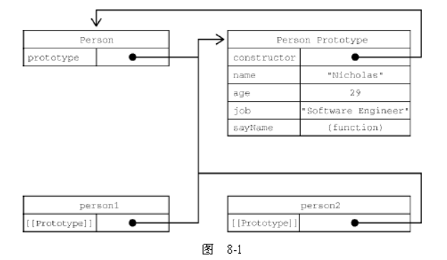
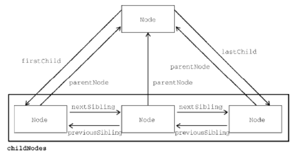
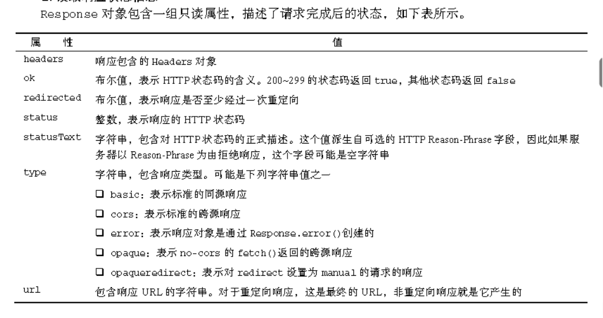

### 弹出一个输入框

```
var degFahren=prompt("Enter the degrees in Fahrenheit","a"); 
```
### 向页面写入字符串显示在页面上

```
document.write("中文" + degCent + "\xB0级"); 
```
### 逐字符转换为整数类型，返回123

```
parseInt("123abc") 
```
### 转换为浮点类型

```
parseFloat()  
```
### 转换为数值类型

```
Number()
```
### 返回一个布尔值，表示参数是否为空

```
isNaN("qwe")  
console.log(Object.is("abc", "abc"));    //判断两参数是否相等
```
### 返回数据类型

```
typeof "sdfg"
```
### 实例一个数组

```
var myArray = new Array();   
var myArray = new Array(6);
var myArray = new Array("a","b","c","d");
myArray[0]="a";
```
### 判断变量是否为空

```
isNaN(degree) == true  

```
### 选出字符串中所在位置的字符

```
str1.charAt(1)  
```
### 选出字符串中所在位置的字符的编码

```
str1.charCodeAt(1);  
```
### 将编码转换为字符

```
var myString = String.fromCharCode(65,66,67); 
```
### 从第4个字符开始向后获取字符出现的位置

```
var a = str1.indexOf("s",3);
```
### 从倒数第二个字符开始获取字符出现的位置

```
var b = str1.lastIndexOf("e",1);
```
### 截取0-3四位字符

```
var mySubString = str1.substring(0,4);
```
### 从0开始截取四位字符

```
var b = str1.substr(0,4);
```
### 转为大小写

```
var a = str1.toLowerCase(); 
var a = str1.toUpperCase(); 
```
### Math对象

```
Math.abs(num);  //绝对值
Math.ceil(num);   //向上取整
Math.floor(num);  //向下取整
Math.round(num);  //四舍五入
Math.random();   //返回0-1之间的随机数
Math.pow(n,m);   //计算n的m次幂
```
### 截取小数点后3位并四舍五入

```
var b = a.toFixed(3);
```
### 数组连接排序

```
var a = new Array();
var b = new Array();
var c = a.concat(b);   //连接两个数组
var c = b.slice(1,3);  //截取数组1-2两个数组元素
var c = b.join(" ");   //以空格连接数组元素生成一个字符串,默认以逗号连接
var c = b.sort();    //数组排序
var c = c.reverse();   //反转排序
```
### Date对象方法

```
var c = a.getDate();   //返回一个整数，表示当前日期月份中的第几天
var c = a.getDay();   //返回一个整数，表示当前日期星期几，0表示星期日，1表示星期一
var c = a.getMonth();   //返回一个表示当前月份的整数，0表示一月
var c = a.getFullYear();   //返回一个以4位数表示的年份
var c = a.toDateString();   //基于当前时区，返回一个人们可理解日期字符串
dateNow.setDate(10);  //设置月中的某一天
dateNow.setMonth(2);   //设置年中的某一月,0表示一月
dateNow.setFullYear(2023);   //以4位数字的方式设置年份
var c = a.getHours();  //获取当前小时
var c = a.getMinutes();  //获取当前分钟数
var c = a.getSeconds();  //获取当前秒数
var c = a.getMilliseconds();  //获取当前毫秒数
var c = a.toTimeString();  //获取当前完整时间
```
### 浏览器对象

```
document对象代表了浏览器中的页面
history对象包含了用户所访问过的页面的历史信息
navigator对象包含了浏览器自身的相关信息，最常见的用途是用于区分不同的浏览器以导向不同的页面
screen对象包含了客户端计算机显示器显示能力的信息
location对象包含浏览器所加载的当前页面的URL的详细信息，还包含了提供Web服务的服务器信息、连接到服务器的端口号及所使用的协议信息
```
### 设置浏览器状态栏

```
window.defaultStatus = "Hello and Welcome";
```
### history对象

```
history.length  //获得浏览器历史栈中页面的个数
history.back()  //加载上一个页面
history.forward()  //加载后一个页面
history.go(-2)    //加载以当前页面为基准的上2个页面
history.go(2)    //加载以当前页面为基准的后2个页面
```
### location对象

```
location.href   //获取网址
location.hostname   //获取服务器名
location.port    //获取服务器端口号
location.protocol    //获取通信协议
window.location.replace("myPage.html")    //加载网页，但不能回退到当前页面，即覆盖历史栈
window.location.herf = "myPage.heml"    //加载网页，可以通过点击回退到上一面
```
### screen对象

```
screen.height    //返回客户端屏幕的高度
screen.width    //返回客户端屏幕的宽度
screen.colorDepth    //返回客户端屏幕的颜色的色彩位数
```
### images数组对象

```

document.images[0].src=myImages[imgIndex];    //动态设置图片地址
```
### links数组对象

```
<a href="sd">搜索</a>
document.links[0].href=myImages[imgIndex];   //动态设置链接地址
```
### 事件处理器

```
<a href="tabletest.html" name=a onclick="alert('werty')">搜索</a>    //捕获alter事件，先触发alert事件再跳转页面
<a href="tabletest.html" name=a onclick="return BoolYS()">搜索</a>  //BoolYS()函数有返回值，返回true则跳转页面，返回false则不跳转页面

document.links[0].onclick = altt;    //将事件处理器作为浏览器对象的属性
```
### 浏览器版本检测

```
//判断浏览器是否支持某个属性，此例中为all属性
if(document.all)       
{
    document.write("true");
}
else
{
    document.write("false");
}
```
```
//判断浏览器是否支持某个方法，此例中为getElementById方法
if(document.getElementById)       
{
    document.write("true");
}
else
{
    document.write("false");
}
```
```
//判断浏览器是否支持某个方法，此例中为getElementById方法
<noscript>代码内容</noscript>
```
```
//navigator对象检测浏览器版本
navigator.appName    //返回浏览器的原型
navigator.userAgent  //返回一个包含了浏览器的版本、操作系统名称以及浏览器的原型等信息的字符串
```
### 表单

 - name    设置表单名称
 - action  设置提交位置
 - method  用来定义信息提交的方式
 - target  用来指定服务器返回结果所显示的目标窗口或目标框架

```
document.FormName   //通过表单名称名称访问表单对象
document.forms[0]   //通过表单数组访问表单对象
document.forms[0].elements[0]   //表单的elements[0]数组表示表单中所有表单控件对应的元素对象
```
###### 表单控件

 - Text Box  
   ```<input type="text" name="myText" size=10 maxlength=15 value="Heelo Work" readonly=true>```
 - Password Box  
   ```<input type="Password">```
 - TextArea  
   ```<textarea name="myTextArea cols=40 rows=20">Hello Word</textarea>```
 - Check boxes  
   ```<input type="checkbox" name="chkDVD" checked value="DVD">```
 - Radio buttons  
   ```
   <input type="radio"  name="radCPUSpeed" checked value="1 GHz">
   //以name属性进行分组
   ```
 - Drop Down List  
   ```
   <select size="1">
       <option value="First List Item" selected>First List Item</option>
   </select>
   ```
 - LIst Boxes  
   ```
   <select size="2">     //size表示直接可见的选项数目
        <option value="First List Item">first list item</option>
        <option value="Second List Item">Second list item</option>
   </select>
   
   var myNewOption = new Option("TheText","TheValue");
   document.theForm.theSelectObject.option[0] = myNewOption;     //增加一个选项
   document.theForm.theSelectObject.option[0] = null;     //移除一个选项
   ```
 - Standard Button  
   ```<input type="button" name="myButton" value="Click Me" onclick="button_onclick()" onmousedown="byButton_onmousedown()" onmouseup="byButton_onmouseup()">```
 - Submit Button  
   ```<input type="submit" value="Submit" name="submit1">```
 - Reset Button  
   ```<input type="reset" value="Reset" name="reset1">```
 - 隐藏域
   ```
   //用于多个表单在不同页面上填写
   <input type="hidden" name="myHiddenElement">
   ```

###### 表单控件属性

 - name     //控件名称
 - value    //控件属性值
 - form     //返回包含控件的表单对象
 - type     //当前表单元素的类型信息
 - warp    //textarea控件，默认值为soft表示自动换行，设置为off表示关闭自动换行
 - multiple   //select控件，是否可多选

###### 表单控件方法

 - focus()    //获得焦点
 - blur()     //失去焦点
 - onmousedown   //button按下鼠标后触发
 - onmouseup     //button抬起鼠标后触发
 - select()     //Text文本框使用此方法可以选中文本框中的内容
 - onchange()   //Text文本框方法
 - onselect()   //Text文本框方法
 - onkeydown    //Text文本框方法
 - onkeypress    //Text文本框方法
 - onkeyup      //Text文本框方法

###### 表单控件事件处理器

 - onfocus    //获得焦点时触发
 - onblur     //失去焦点时触发

### 框架

###### 框架与window对象  

```
<frameset rows="20%,*" id="TopWindow">    //网页中包含两个页面window对象,可以在框架内嵌套使之再细分
    <frame name="UpperWindow" src="UpperWindow.html">
    <frame name="LowerWindow" src="LowerWindow.html">
</frame>

window.parent   //表示框架的父框架对象的引用
window.top      //表示框架的最顶层框架对象的引用
```
###### 打开新的浏览器窗口

```
function openother()
{
    var newWindow;
    //参数1表示新开窗口加载的网页URL，空白表示空白的窗口；第二个参数表示新加载的targer属性；第三个参数表示新窗口的屏幕属性;newWindow变量表示新打开的这个窗口
    newWindow = window.open("1.html",“myWindow”,“width=200,height=200,resizable”);
    newWindow.document.open();         //将新窗口清空,打开一个新的空白窗口
    newWindow.document.write("HTML")   //在新窗口中重新写入html
    newWindow.document.close();        //关闭窗口
    newWindow.document.write("HTML")   //已关闭窗口后再写入将覆盖原窗口内容
    newWindow.opener.document.bgColor  //opener属性表示源窗口的引用
    newWindow.resizeTo(350,200)        //将窗口大小设置350*200
    newWindow.moveTo(100,400)          //将窗口移动到距离屏幕左边界100像素，距离上边界400像素的位置
    newWindow.resizeBy(100,200)   //窗口的大小在水平方向上增加100像素，在垂直方向上增加200像素
    newWindow.moveBy(20,50)            //窗口在水平方向上移动20像素，在垂直方向上移动50像素
}

//target属性表示在新的窗口打开指定的网页
<a href="tabletest.html" name=a onclike="openother()" target="myWindow">搜索</a>
```
###### 新的浏览器窗口属性

```
newWindow.copyHistory = yes/no   //当打开新窗口时是否复制当前窗口的历史记录
newWindow.directories = yes/no   //新窗口是否显示目录栏按钮
newWindow.height = 200           //新窗口的高度，以像素为单位
newWindow.left =20               //新窗口的left坐标
newWindow.location = yes/no      //新窗口是否显示地址栏
newWindow.menubar = yes/no       //新窗口是否显示菜单栏
newWindow.resizeable = yes/no    //新窗口是否允许调整窗口大小
newWindow.scrollbars = yes/no    //是否允许新窗口使用滚动条
newWindow.status = yes/no        //新窗口是否显示状态栏
newWindow.toolbar = yes/no       //新窗口是否显示工具栏
newWindow.top = 20               //新窗口top坐标
newWindow.width = 20             //新窗口的宽度
```

### 字符串对象
###### split()方法

```
//分割字符串
var myString = "A,B,C"
var myTextArray = myString.split(',');

var myString = "Ai,Bi,C"
var myRegExp = /(i,)?/gi;
var myTextArray = myString.split(myRegExp);     //结合正则表达式分割字符串

```
###### replace()方法

```
//将字符串中的A替换成D
var myString = "A,B,C"
var myTextArray = myString.replace('A','D');

//运用正则表达式替换掉所有的ee字符串
var myString = "aa,bb,cc,dd,aa,bb";
var myRegExp = /bb/gi;
myString = myString.replace(myRegExp,'ee');
```
###### search()方法

```
var myString = "abcdefghijk"
var myTextArray = myString.search('de');   //返回'de'在字符串中首次出现的位置，此例中返回3

var myString = "abcdefghijk"
var myRegExp = /[c-e]+/gi;
var myTextArray = myString.search(myRegExp);     //结合正则表达式search字符串
```
###### match()方法

```
var myString = "abcdefghijk";
var myTextArray = myString.match('de');   //返回返回一个数组

var myString = "abcdefghijk";
var myRegExp = /[c-e]+/gi;
var myTextArray = myString.match(myRegExp);    //结合正则表达式匹配字符串
```
###### 正则表达式RegExp对象

```
var myRegExp = /\b'|'\b/;     //声明RegExp对象写法一
var myRegExp = new RegExp("/\b'|'\b/");     //声明RegExp对象写法二
myRegExp.test("sdfgsdfgb")       //返回布尔值是否匹配到对象
myRegExp.exec("sdfgsdfgb")    //返回匹配到的对象
```

###### 正则表达式的特性

|特性字符|描述|  
|:---:|:---|  
| g | 表示全局匹配，即查找所有与模式匹配的子串，而不是在查找到第一个匹配的子串之后 就停止查找 |
|i|表示忽略字母的大小写|
|m|该标记指定了元字符^和$可以匹配多行字符串的开始和结束位置|

### Number类型

```
Number.MAX_VALUE   //NUMBER最大取值
Number.MIN_VALUE   //NUMBER最小取值
```
### 字符串插值(格式化)

```
let value = 5
let a = `${ value } to the ${ exponent } power is ${ value * value };`  //返回5 to the second power is 25
```

### 位操作符
###### 按位与

```
let result = 25 & 3;
console.log(result); // 1   按位与操作在两个位都是1 时返回1，在任何一位是0 时返回0。
```
###### 按位或

```
let result = 25 | 3;
console.log(result); // 27   按位或操作在至少一位是1 时返回1，两位都是0 时返回0。

```
###### 按位异或

```
let result = 25 ^ 3;
console.log(result); // 26   只在一位上是1 的时候返回1（两位都是1 或0，则返回0）
```
###### 左移

```
let oldValue = 2; // 等于二进制10
let newValue = oldValue << 5; // 等于二进制1000000，即十进制64
```
###### 有符号右移

```
let oldValue = 64; // 等于二进制1000000
let newValue = oldValue >> 5; // 等于二进制10，即十进制2
```
###### 无符号右移

```
let oldValue = 64; // 等于二进制1000000
let newValue = oldValue >>> 5; // 等于二进制10，即十进制2
```

### 控制台输出格式化

```
console.log('%d + %d = %d',1,1,2);   //格式化
console.error('输出错误信息，会以红色显示');
console.warn('打印警告信息，会以黄色显示');
console.info('打印一般信息');
console.clear();   //清空console显示
%s      字符串
%d %i   整数
%f      浮点数
%o %O   Object对象
%c      css样式

//显示调用时间
console.time();
    for(var i=0;i<100000;i++){
        var j=i*i;
    }
    console.timeEnd();

//统计代码或函数被调用了多少次
    var fn_ = function(){ console.count('hello world'); }
    for(var i=0;i<5;i++){
        fn_();
    }

//控制台分组显示
console.group('分组1');
    console.log('语文');
    console.log('数学');
        console.group('其他科目');
        console.log('化学');
        console.log('地理');
        console.log('历史');
        console.groupEnd('其他科目');
    console.groupEnd('分组1');
```
### 函数

###### 函数的定义方式

- 方式一：
```
function sum (num1, num2) {
return num1 + num2;
}
```
- 方式二：
```
let sum = function(num1, num2) {
return num1 + num2;
};
```
- 方式三：
```
let sum = (num1, num2) => {
return num1 + num2;
};
```
- 方式四：
```
let sum = new Function("num1", "num2", "return num1 + num2"); // 不推荐
```

###### 对象原型



##BOM

#### window窗口对象

###### 窗口关系

- window.parent  //父窗口
- window.top    //最顶层窗口
- window.self   //窗口自身
- 
######窗口大小尺寸
- window.innerWidth　　　　//浏览器页面视口宽度（不包含浏览器边框和工具栏）。
- window.innerHeight　　　　//浏览器页面视口高度（不包含浏览器边框和工具栏）。
- window.outerWidth　　　　//浏览器自身的宽度
- window.outerHeight　　　　//浏览器自身的高度
- document.documentElement.clientWidth　　　//浏览器某个元素的宽度
- document.documentElement.clientHeight　　　//浏览器某个元素的高度
- window.resizeTo(100, 100);　　//缩放窗口大小为100*100
- window.resizeBy(100, 50);　　　//窗口放大100、50
- 
######视口位置
- window.scrollBy(0, 100);　　　//视口向下100像素
- window.scrollBy(40, 0);　　　//视口向右100像素
- window.scrollTo(0, 0);　　　//滚动到页面左上角
- window.scrollTo({left: 100,top: 100,behavior: 'auto'});　　//正常滚动
- window.scrollTo({left: 100,top: 100,behavior: 'smooth'});　　//平滑滚动

###### 打开新窗口

```
//第一个参数表示打开的网址
//第二个参数表示打开的新窗口的名称，可以为_self、_parent、_top、_blank或其它自定义名
//第三个参数表示新窗口的特性
window.open("https://cn.bing.com/", "_blank","location=no");
```
新窗口特性

|特性|值|说明|
|:---|:---|:---|
|fullscreen|"yes"或"no"|表示新窗口是否最大化。仅限IE 支持|
|height|数值|新窗口高度。这个值不能小于100|
|left|数值|新窗口的x 轴坐标。这个值不能是负值|
|location|"yes"或"no"|表示是否显示地址栏。不同浏览器的默认值也不一样。在设置为"no"时，地址栏可能隐藏或禁用（取决于浏览器）|
|Menubar|"yes"或"no"|表示是否显示菜单栏。默认为"no"|
|resizable|"yes"或"no"|表示是否可以拖动改变新窗口大小。默认为"no"|
|scrollbars|"yes"或"no"|表示是否可以在内容过长时滚动。默认为"no"|
|status|"yes"或"no"|表示是否显示状态栏。不同浏览器的默认值也不一样|
|toolbar|"yes"或"no"|表示是否显示工具栏。默认为"no"|
|top|数值数值|新窗口的y 轴坐标。这个值不能是负值|
|width|数值|新窗口的宽度。这个值不能小于100|

######系统对话框
- alert("提示信息")　　　　　　　　//提示用户
- let a = confirm("提示信息")　　　//需要用户确认，返回布尔值
- let a = prompt("提示信息")　　　//用户输入信息

#### location对象

|属性|说明|
|:---|:---|
|location.hash|URL 散列值（井号后跟零或多个字符），如果没有则
为空字符串|
|location.host|服务器名及端口号|
|location.hostname|服务器名|
|location.href|当前加载页面的完整URL。location 的toString()
方法返回这个值|
|location.pathname|URL 中的路径和（或）文件名|
|location.port|请求的端口。如果URL中没有端口，则返回空字符串|
|location.protocol|页面使用的协议。通常是"http:"或"https:"|
|location.search|URL 的查询字符串。这个字符串以问号开头|
|location.username|域名前指定的用户名|
|location.password|域名前指定的密码|
|location.origin|URL 的源地址。只读|


####navigator对象
|属性方法|说明|
|:---|:---|
|activeVrDisplays|返回数组，包含ispresenting 属性为true 的VRDisplay 实例|
|appCodeName|即使在非Mozilla 浏览器中也会返回"Mozilla"|
|appName|浏览器全名|
|appVersion|浏览器版本。通常与实际的浏览器版本不一致|
|battery|返回暴露Battery Status API 的BatteryManager 对象|
|buildId|浏览器的构建编号|
|connection|返回暴露Network Information API 的NetworkInformation 对象|
|cookieEnabled|返回布尔值，表示是否启用了cookie|
|credentials|返回暴露Credentials Management API 的CredentialsContainer 对象|
|deviceMemory|返回单位为GB 的设备内存容量|
|doNotTrack|返回用户的“不跟踪”（do-not-track）设置|
|geolocation|返回暴露Geolocation API 的Geolocation 对象|
|getVRDisplays()|返回数组，包含可用的每个VRDisplay 实例|
|getUserMedia()|返回与可用媒体设备硬件关联的流|
|hardwareConcurrency|返回设备的处理器核心数量|
|javaEnabled|返回布尔值，表示浏览器是否启用了Java|
|language|返回浏览器的主语言|
|languages|返回浏览器偏好的语言数组|
|locks|返回暴露Web Locks API 的LockManager 对象|
|mediaCapabilities|返回暴露Media Capabilities API 的MediaCapabilities 对象|
|mediaDevices|返回可用的媒体设备|
|maxTouchPoints|返回设备触摸屏支持的最大触点数|
|mimeTypes|返回浏览器中注册的MIME 类型数组|
|onLine|返回布尔值，表示浏览器是否联网|
|oscpu|返回浏览器运行设备的操作系统和（或）CPU|
|permissions|返回暴露Permissions API 的Permissions 对象|
|platform|返回浏览器运行的系统平台|
|plugins|返回浏览器安装的插件数组。在IE 中，这个数组包含页面中所有<embed>元素|
|product|返回产品名称（通常是"Gecko"）|
|productSub|返回产品的额外信息（通常是Gecko 的版本）|
|registerProtocolHandler()|将一个网站注册为特定协议的处理程序|
|requestMediaKeySystemAccess()|返回一个期约，解决为MediaKeySystemAccess 对象|
|sendBeacon()|异步传输一些小数据|
|serviceWorker|返回用来与ServiceWorker 实例交互的ServiceWorkerContainer|
|share()|返回当前平台的原生共享机制|
|storage|返回暴露Storage API 的StorageManager 对象|
|userAgent|返回浏览器的用户代理字符串|
|vendor|返回浏览器的厂商名称|
|vendorSub|返回浏览器厂商的更多信息|
|vibrate()|触发设备振动|
|webdriver|返回浏览器当前是否被自动化程序控制|

#### screen对象

|属性|说明|
|:---|:---|
|availHeight|屏幕像素高度减去系统组件高度（只读）|
|availLeft|没有被系统组件占用的屏幕的最左侧像素（只读）|
|availTop|没有被系统组件占用的屏幕的最顶端像素（只读）|
|availWidth|屏幕像素宽度减去系统组件宽度（只读）|
|colorDepth|表示屏幕颜色的位数；多数系统是32（只读）|
|height|屏幕像素高度|
|left|当前屏幕左边的像素距离|
|pixelDepth|屏幕的位深（只读）|
|top|当前屏幕顶端的像素距离|
|width|屏幕像素宽度|
|orientation|返回Screen Orientation API 中屏幕的朝向|

#### history对象

```
history.go(-1);　　//后退一页

history.go(1);　　//前进一页

history.go(2);　　//前进两页

history.go("wrox.com");　　// 导航到最近的历史 wrox.com 页面
```

## DOM
###### 节点层级

```
                        parentNode
                            |
  previousSibling <--  childNode --> nextSibling
                            |
                        NodeList
                            |
ownerDocument  <--  hasChildNodes()
```



###### 节点类型

|类型|编号|说明|
|:-|:-:|:-|
|Node.ELEMENT_NODE|1|元素节点|
|Node.ATTRIBUTE_NODE|2|特性节点|
|Node.TEXT_NODE|3|文本节点|
|Node.CDATA_SECTION_NODE|4|XML中特有的CDATA 区块|
|Node.ENTITY_REFERENCE_NODE|5||
|Node.ENTITY_NODE|6||
|Node.PROCESSING_INSTRUCTION_NODE|7||
|Node.COMMENT_NODE|8|注释节点|
|Node.DOCUMENT_NODE|9|文档节点|
|Node.DOCUMENT_TYPE_NODE|10|DocumentType 类型的节点包含文档的文档类型（doctype）信息|
|Node.DOCUMENT_FRAGMENT_NODE|11||
|Node.NOTATION_NODE|12||

###### 操作点

```
--操作子节点
let returnedNode = someNode.appendChild(newNode);　　　//在节点后添加一个新节点
let returnedNode = someNode.insertBefore(newNode, someNode.firstChild);　　　//新节点插入到指定子节点位置
let returnedNode = someNode.replaceChild(newNode, someNode.firstChild);　　　//新节点替换旧子节点
let formerFirstChild = someNode.removeChild(someNode.firstChild);　　　//移除某个子节点

let deepList = myList.cloneNode(true);　　　//深复制某个节点(本节点及子节点)，可通过节点操作添加到DOM文档中
let deepList = myList.cloneNode(false);　　　//浅复制某个节点(本节点)
```

#### Document类型

```
let html = document.documentElement;　　　//获取文档HTML元素
let html = document.body;　　　//获取文档body元素
let doctype = document.doctype;　　　//获取文档<!doctype>元素

let originalTitle = document.title;　　　//获取文档标题
let url = document.URL;　　　//获取文档完整URL
let domain = document.domain;　　　//获取文档域名
let referrer = document.referrer;　　　//获取文档来源。
document.anchors　　　//包含文档中所有带name 属性的<a>元素。
ocument.forms　　　//包含文档中所有<form>元素
document.images　　　//包含文档中所有元素
document.links 　　　//包含文档中所有带href 属性的<a>元
```

###### Document方法

```
let div = document.getElementById("myDiv");

let images = document.getElementsByTagName("img");
let myImage = images.namedItem("myImage");　　　//name属性定位元素
let myImage = images["myImage"];　　　// 同上
alert(images[0].src);　　　// 第一张图片的src 属性
alert(images.item(0).src);　　　// 同上

let radios = document.getElementsByName("color");

document.write();　　　//写入文本或html标签
document.writeln();　　　//写入文本或html标签,之后换行
document.open();　　　//打开网页输出流
document.close();　　　//关闭网页输出流
```

#### Element类型

```
let div = document.getElementById("myDiv");
alert(div.getAttribute("id")); // "myDiv"　　　//获取元素属性

div.setAttribute("id", "someOtherId");　　　//设置元素属性

div.removeAttribute("class");　　　//移除元素属性

element.attributes.getNamedItem(name);　　　//返回nodeName 属性等于name 的节点
element.attributes.removeNamedItem(name);　　　//删除nodeName 属性等于name 的节点
element.attributes.setNamedItem(node);　　　//向列表中添加node 节点，以其nodeName 为索引
element.attributes.item(pos);　　　//返回索引位置pos 处的节点

let id = element.attributes.getNamedItem("id").nodeValue;　　　//返回元素的ID值
let id = element.attributes["id"].nodeValue;　　　//同上

let div = document.createElement("div");　　　//新建一个标签元素
```

#### Text类型

```
appendData(text)　　　//向节点末尾添加文本text
deleteData(offset, count)　　　//从位置offset 开始删除count 个字符
insertData(offset, text)　　　//在位置offset 插入text；
replaceData(offset, count, text)　　　//用text 替换从位置offset 到offset + count 的
文本
splitText(offset)　　　//在位置offset 将当前文本节点拆分为两个文本节点
substringData(offset, count)　　　//提取从位置offset 到offset + count 的文本

div.firstChild.nodeValue = "Some other message";　　　//修改Text节点

let textNode = document.createTextNode("Hello world!");　　　//新建Text节点
element.appendChild(textNode);
```

#### Comment类型

```
let div = document.getElementById("myDiv");
let comment = div.firstChild;
alert(comment.data);　　　//"A comment"   data注释内容
```

#### response属性


#### ajax

```
$.ajax({
  type: 'POST',
  url: url,
  data: data,
  success: success,
  dataType: dataType
});
简写为：
$.post(ajaxurl,ajax_data,function(status){
                ...函数体
            });
```

#### 零散收集
- javascript:void(0)  //该操作符指定要计算一个表达式但是不返回值。
    + a href="javascript:void(0);  //表示一个死链接
- HTML转义字符
    + [HTML转义字符](https://www.cnblogs.com/yasmi/articles/4884396.html)