# 学习shell
### shell简介

- 当前系统时间和日期
```
date
```
- 当前系统日历
```
cal
```
- 查看磁盘驱动器当前的可用空间
```
df
```
- 显示系统可用内存
```
free
```
- 关闭终端容器
```
exit
```

### 路径导航

- 在windows系统中，每个存储都有一个独立的文件系统树，在UNIX系统中，无论多少驱动器或存储设备与计算机相连，通常只有一个文件系统树，各存储设备将会挂载到文件系统的不同位置

- 显示当前工作目录
```
pwd
```
- 列出当前工作目录的文件和内容
```
ls
注意：以‘.’字符开头的文件是隐藏文件，ls不会列出这些文件，除非输入ls-a

ls /user   //指定要显示的目录

ls ~ /user   //显示多个目录，此例表示主目录及user目录

ls -l  //目录以长格式显示
```
###### ls命令参数选项

|选项|长选项|含义|
|:---|:---|:---|
|-a|--all|列出所有文件，包括隐藏文件|
|-d|--directory|指定一个目录将列出目录中的内容而不是目录本身，与-l结合使用，可查看目录的详细信息而不是目录中的内容|
|-F|--classify|在每个所列出的名字后面加上类型指示符|
|-h|--human-readable|以长格式列出，以人们可读的方式而不是字节数来显示文件大小|
|-l||使用长格式显示结果|
|-r|--reverse|以相反的顺序显示结果|
|-S||按文件大小对结果排序|
|-t||按修改时间排序|

###### 目录长格式显示字段含义
-rw-r--r-- 1 root root 32059 2012-04-03 11:05 oo-cd-cover.odf

-rw-r--r--   //第一个字符表示文件类型，2-4个字符表示所有者权限，5-7个字符表示组权限，8-10个字符表示其他用户权限

|字段|含义|
|:---|:---|
|-rw-r-r--|对文件 的访问权限，第一个字符表示文件的类型，开头的‘-’表示该文件是一个普通文件，d表示目录，紧接着三个字符表示文件所有者的访问权限，再接着的三个字符表示文件所属组中成员的访问权限，最后三个字符表示其他所有人的访问权限|
|1|文件硬链接数目|
|root|文件所有者的用户名|
|root|文件所属用户组的名称|
|32059|以字节数表示文件的大小|
|2012-04-03 11：05|上次修改文件的日期和时间|
|oo-cd-cover.odf|文件名|

- 文件类型

|属性|文件类型|
|:---|:---|
|-|普通文件|
|d|目录文件|
|l|符号链接|
|c|字符设备文件|
|b|块设备文件|

- 权限类型

|属性|文件|目录|
|:---|:---|:---|
|r|允许打开和读取文件|如果设置了执行权限，那么允许列出目录下的内容|
|w|允许写入或截短文件，如果设置了执行权限，那么目录中的文件允许被创建、被删除以及被重命名|但是该权限不允许重命名或者删除文件，是否能重全命名和删除文件由目录权限决定|
|x|允许把文件当做程序一样来执行，用脚本语言写的程序文件必须被设置为可读，以便能被执行|允许进入目录下|


- 更改当前工作目录
```
cd
```
- 更改路径快捷方式
```
cd    //将工作目录变成主目录
cd-   //将工作目录变成先前的工作目录
cd~username    //将工作目录改变为username的主目录
```

### Linux系统

- 确定文件类型
```
file filename
如:file picture.jpg
```
- 查看文件内容
```
less filename
```
###### less命令翻页

|命令|功能|
|:---|:---|
|PAGE UP|后翻一页|
|PAGE DOWN|前翻一页|
|向上箭头|向上一行|
|向下箭头|向下一行|
|G|跳转到文本末尾|
|g|跳转到文本开头|
|/char|搜索指定的字符串|
|n|搜索下一个字符|
|h|显示帮助屏幕|
|q|退出less|

### 操作文件与目录
###### 通配符

|字符|含义|
|:---|:---|
|*| 匹配任意多个字符|
|? |匹配任一单一字符|
|[characters]| 匹配任意一个属于字符集中的字符|
|[!characters]| 匹配任意一个不属于字符集中的字符|
|[[:class:]] |匹配任意一个属于指定字符类的字符|
|[:alnum:] |匹配一个字母或数字|
|[:alpha:] |匹配一个字母|
|[:digit:] |匹配一个数字|
|[:lower:] |匹配一个小写字母|
|[:upper:] |匹配一个大写字母|


- 创建目录
```
mkdir directory
```
- 复制文件和目录
```
cp item1 item2    //item1复制到item2
cp item... directory   //将多个项目复制进一个目录中
```
###### cp命令选项

|选项|含义|
|:---|:---|
|-a,--archive|复制文件和目录及其属性，包括所有权和权限|
|-i,--interactive|在覆盖一个已存在的文件前，提示用户进行确认，如果没有指定该选项，cp会默认覆盖文件|
|-r,--recursive|递归地复制目录及其内容，复制目录时需要这个选项|
|-u,--updat|当将文件从一个目录复制到另一个目录时，只会复制那些目标目录中不存在的文件或是目标相应文件的更新文件|
|-v,--verbose|复制文件时，显示信息性消息|

- 移除和重命名文件
```
mv item1 item2   //item1移动到item2
mv item... directory   //将多个项目移动到另一个目录中
```
###### mv命令选项

|选项|含义|
|:---|:---|
|-i,--interactive|覆盖一个已存在的文件之前，提示用户确认，如果没有指定该选项，mv会默认覆盖文件|
|-u,--update|将文件从一个目录移到另一个目录，只移动那些目标目录中不存在的文件或是目标目录里相应文件的更新文件|
|-v,--verbose|移动文件时显示信息性消息|

- 删除文件和目录
```
rm item...   //删除文件和目录

rm -rf directory    //删除文件夹
```
###### rm命令选项

|选项|含义|
|:---|:---|
|-i,--interactive|删除一个已存在的文件，提示用户确认，如果没有指定这个选项，rm命令会默认删除文件|
|-r,--revursive|递归地删除目录及其内容，如果删除的目录有子目录的话，也要将其删除，要删除一个目录，则必须指定该选项|
|-f,--force|忽略不存在的文件并无需提示确认，该选项会覆盖--interactive选项|
|-v,--verbose|删除文件时显示信息性消息|

- 创建链接
```
ln file link  //创建硬链接
ln -s item link   //创建符号链接
```

### 命令的使用

###### 命令分类

> - 可执行程序
> - shell内置命令
> - shell函数
> - alias命令


- 显示命令的类型
```
type command
```

- 显示可执行程序的位置
```
which command
```

- 帮助文档
```
help command
```
- 显示命令的使用信息
```
command --help
```

- 显示程序的手册页
```
man program
```

- 显示合适的命令
```
apropos
```

- 显示命令的简要描述
```
whatis
```

- 显示程序的info条目
```
info coreutils
```

- 创建别名
```
alias
例：alisa foo='cd'   //shell窗口关闭，别名自动消失
unalias foo  //删除别名
```

### 重定向

- 输出到一个文件
```
ls -l /bin/usr > ls-output.txt   //输出到txt文件
ls -l /bin/usr >> ls-output.txt   //在文件末尾输出到txt文件

> ls-output.txt   //新建一个空白文件或清空文件内容
```
> 文件流分三种：标准输入文件流(0)、标准输出文件流(1)、标准错误文件(2)
 >> ls -l /bin/usr 2> ls-output.txt
 >>  ls -l /bin/usr > ls-output.txt 2>&1  //将标准输出和标准错误重定向到同一个文件
 >>  ls -l /bin/usr &> ls-output.txt   //将标准输出和标准错误重定向到同一个文件
 >>   ls -l /bin/usr 2> /dev/null    // /dev/null是一个特殊的位桶，它接受输入但不对输入进行任何处理，也就没有输出

- 合并文件
```
cat filename...

cat output.txt  //屏幕显示文本文件
cat -A output.txt   //包含特殊字符显示文本文件

cat -n output.txt   //加行号显示文本

cat -s output.txt   //禁止输出多个空白行 

cat -ns output.txt  //n和s选项合并显示

cat output1.txt output2.txt > output3.txt  //两个文件合并输入到output3.txt文件中

cat > output.txt   //将键盘输入的字符输出到output.txt文件中

cat < output.txt   //从文件中读取字符输入显示在屏幕上

```

- 排序
 ```
sort foo.txt  //以行为单位排序文本文件

sort  //排序显示当前工作目录文件

sort -u foo.txt   //去除重复行显示
 ```

- sort选项

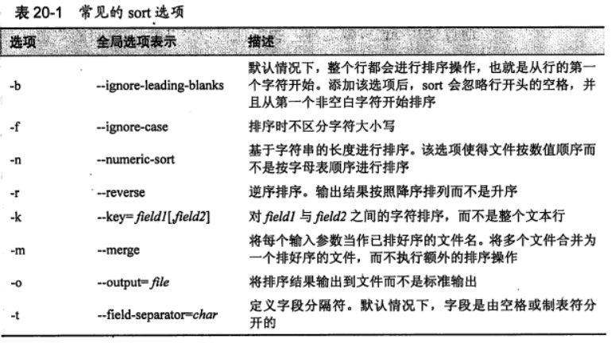

- 报告或忽略文件中的重复的行
```
uniq

ls /bin /usr/bin | sort | uniq | less  //排序并去重，uniq只对相邻的重复行起作用，所有通常和sort排序后一起使用
```

- uniq选项

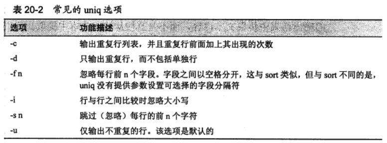

- 删除文本行中的部分内容
```
cut -f 3 distres.txt
```
- cut选项

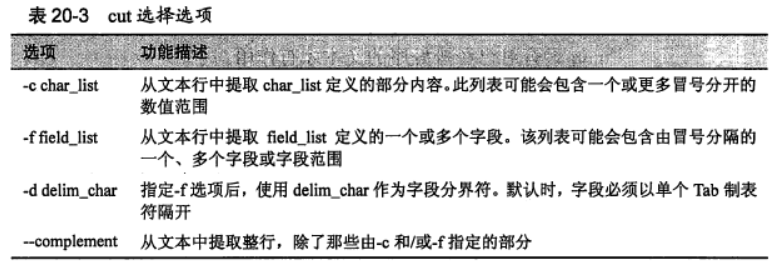

- 打印行数、字数、字节数
```
wc ls-output.txt   //统计行数，字数和字节数
wc -l ls-output.txt  //只统计行数
```

- 合并文本行
```
paste dis.txt foo.txt
```

- 连接两文件中具有相同字段的行
```
join dis.txt foo.txt
```

- 逐行比较两个已排序文件
```
comm file1.txt file2.txt   //输出结果第一列显示第一个文件独有的行，第二列显示第二个参数文件中独有的行，第列显示两个文件共有的行

comm -1 file1.txt file2.txt   //输出结果省略第1列
```

- 逐行比较文件
```
diff file1.txt file2.txt

diff -c file1.txt file2.txt

diff -u file1.txt file2.txt

sdiff file1.txt file2.txt  //左右并排显示文件差异并作比较
```

- diff命令差异标识符

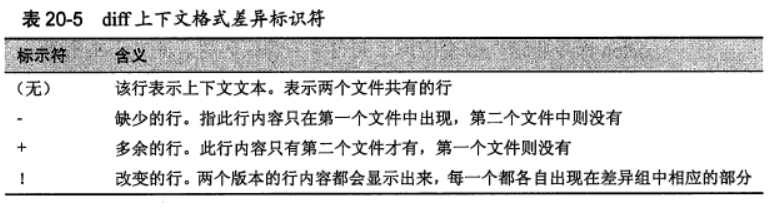

- 对原文件进行diff操作
```
dirr -Naur old_file new_file > diff_file   //生成diff文件
patch < diff_file   //修补原文件升级为最新文件，补丁文件，即将old_fill修改成和new_file一样
```

- 替换和删除字符
```
echo "lowercase letters" | tr a-a A-Z   //转换成大写
echo "lowercase letters" } tr [:lower:] A  //全部转换为大写的A

echo "secret text" | tr a-zA-Z n-za-mN-ZA-M   //ROT13编码环，每人个字母在字母表中向上移动13位，字母表有26位，也就意味着密码和原码同一命令可以相互转化

echo "aaabbbccc" | tr -s ab   //删除重复的ab字符
```

- 用于文本过滤和转换的流编辑器
```
echo "front" | sed 's/front/back'    //set是流式编辑器，此例中s是sed的指令，将back替换掉front

echo "front" | sed 's/front/back/g'    //g表示对所有的匹配项进行替换

echo "front" | sed '2s/front/back'   //2s表示替换只作用在第2行，此例没有第2行所以无效


sed -n '1,5p' distres.txt    //只显示1到5行的内容
```

- sed基本编辑指令
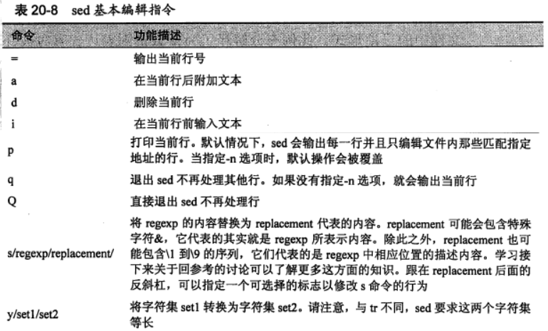

- sed地址表示法
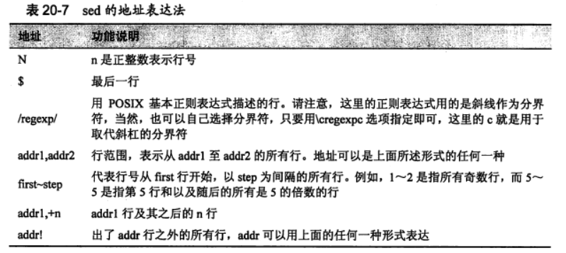

- 交互式拼写检查工具
```
aspell check textfile
```


- 打印匹配行
```
grep pattern[file...]

ls /bin /usr/bin | sort | uniq | grep zip  //执行zip文件

-i 搜索时忽略大小写
-v 只输出和模式不匹配的行
```

- 打印文件的开头部分或结尾部分
```
head -n 5 ls-output.txt    //输出文件的前5行

tail -n 5 ls-output.txt    //输出文件的最后5行
ls /usr/bin | tail -n 5

tail -f ls-output.txt   //实时查看文件，一旦添加新行会立即显示在屏幕上
```

- 从stdin读取，并同时输出到stdout和文件
```
tee  //读取标准输入，再把讲到的内容复制到标准输出，类似于管道数据抓包

ls /usr/bin | tee ls.txt |grep zip   //把目录中的文件都输出到txt文件，再过滤zip文件显示到屏幕上
```

<hr>

### 透过shell看世界

###### 扩展

- echo显示参数
```
echo hello world

echo *  //打印当前工作目录下的所有文件名

echo $((3+4))   //算术扩展，+(加)-(减)*(乘)/(除)%(模)**(幂)*

echo number_{1,2,3,4,5,6}   //花括号扩展
echo number_{1..6}
echo number_{A..B}

echo $(ls)   //命令替换，把一个命令的输出作为一个扩展模式使用
```

- 抑制扩展
```
echo "hello world! $1.00 $((2+3))"    //参数扩展、算术扩展和命令替换在双引号中依然生效

echo 'hello world! $1.00 $((2+3))'   //抑制所有扩展

echo \$hello world!   //转义字符
```

### 高级键盘技巧

- 组合键

|组合键|作用|
|:---|:---|
|Ctrl+A|移动光标到行首|
|Ctrl+E|移动光标到行首|
|Ctrl+F|向右移到一个字符|
|Ctrl+B|向左移到一个字符|
|Alt+F|向前移动一个字|
|Alt+B|向后移动一个字|
|Ctrl+L|清屏|
|Ctrl+D|删除光标处的字符|
|Ctrl+T|使光标处的字符和前一个字符对调位置|
|Alt+T|使光标处的字和前一个字对调位置|
|Alt+U|把光标到字尾的字符转换成大写|
|Alt+L|把光标到字尾的字符转换成小写|
|Ctrl+K|剪切从光标到行尾的文本|
|Ctrl+U|剪切从光标到行首的文本|
|Alt+D|剪切从光标到当前词尾的文本|
|Alt+Backspace|剪切从光标到词头的文本|
|Ctrl+Y|把kill-ring缓冲区中的文本粘贴到光标位置|
|!!|重复最后一个执行命令|

- 搜索历史命令
```
history | less
history !12   //显示历史命令第12行
```


### 权限

###### 更改文件模式(权限)

- 文件权限八进制表示
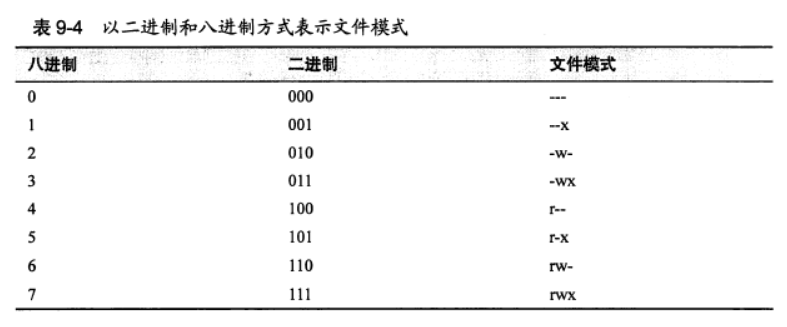
```
chmod 600 foo.txt  //设置为可读可写
```

- chmod更改文件权限符号表示法
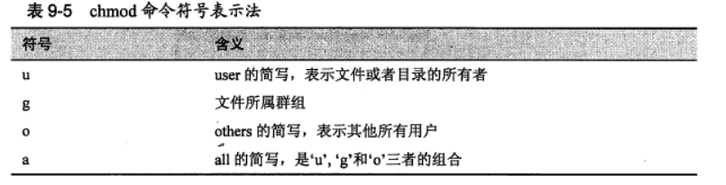
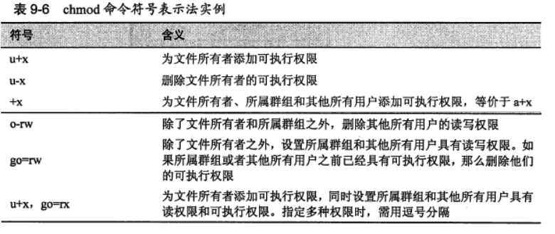

> 没有指定字符，则假定使用all

> 操作符“+”表示添加一种权限

> “-”表示删除一种权限

> “=”表示只有指定的权限可用，其它所有权限都被删除

- 设置默认权限

```
umask  //查看默认掩码

umask 0000  //设置默认掩码，在当前shell会话中有效
```
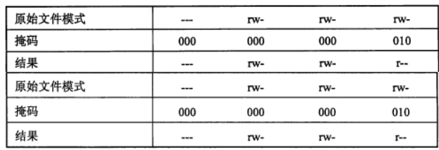


- 以其他用户和组ID的身份来运行shell
```
su [-[l]] [user]   //以指定的用户打开shell界面，进入的也是指定用户的主目录

su -  //以超级用户的身份启动shell

su -c 'command'   //以新界面执行单个命令，单引号不能省略

exit  //退出指定指定用户，返回到之前用户界面
```

- 输出有效用户的数字用户ID编号
```
id -u   //超级用户的编号总是0，其他用户的编号是一个大于0的数字
```

- 以另一个用户的身份执行命令
sudo命令将允许管理者创建一个/etc/sudoer配置文件，并且定义一些特定的命令，这些命令只有被赋予为假定身份和特定用户才允许执行
```
sudo ls   //输入自己的用户密码就可执行命令
```

- 更改文件所有都和所属群组
 > 语法：chown [ower][:[group]] file
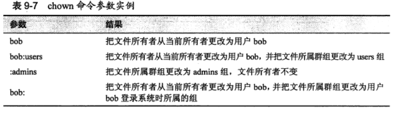

- 更改文件所属群组
```
chgrp  //用法与chown相同
```

- 更改用户密码
```
passwd [user]
```

### 进程

- 查看进程信息
```
ps
ps x   //显示所有进程，stat表示进程的当前状态，time字段表示程序运行时间
ps aux   //显示所有用户的进程
```

- 进程状态

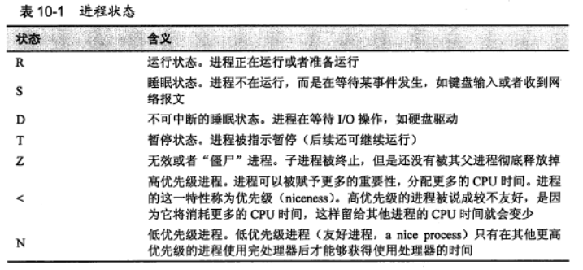
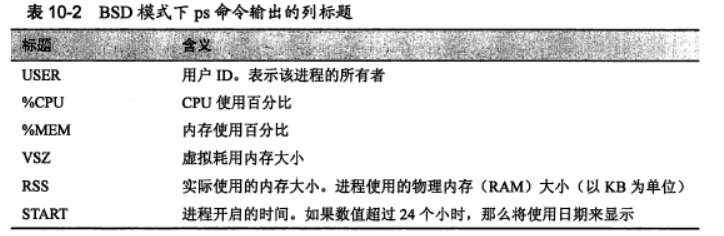

- 动态查看进程信息
```
top
```
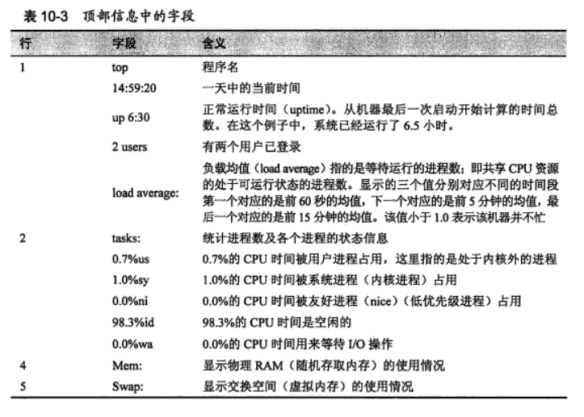

- 使程序在后台运行
```
program.exe &   //指定程序在后台运行

jobs   //查看该终端启动的所有作业

fg %1  //后台程序转换为前台运行，%+jobID
```

- 暂停进程
```
program.exe  Ctrl+Z   //暂停进程并转移到后台

bg %1  //暂停的程序恢复后台运行
fg %1  //暂停的程序恢复前台运行
```

- kill发送信息号进程
```
kill [-signal] pid   //只能给自己用户下的进程发送信号

kill -l    //查看完整的信号列表
```

- kill命令常用信号

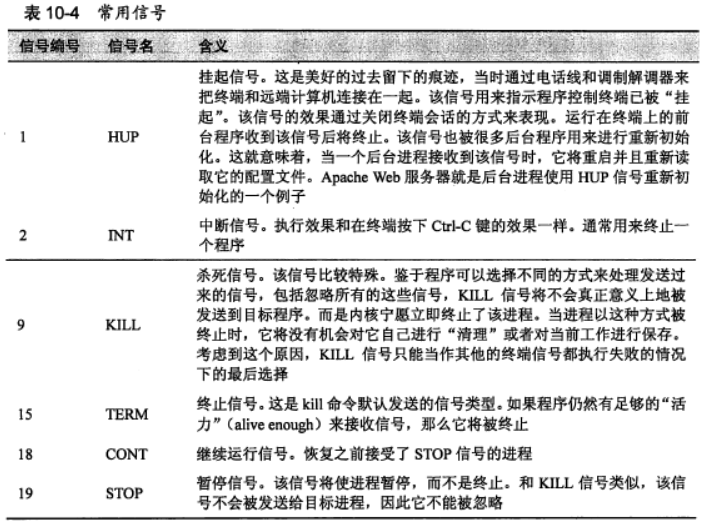

- 发送信息给多个进程
killall [-u user] [-signal] name...

- 其他与进程相关的命令
```
pstree   //以树状的模式输出进程列表
vmstat   //输出系统资源使用情况的快照，包括内存、交换空间和磁盘IO
xload   //用来绘制显示系统时间负载情况图形的一种图形化界面程序
tload   //类似于xload程序，但是图形是终端上绘制
```


# 配置与环境
### 环境

- 检查环境、查看环境变量
```
printenv   //只显示环境变量
printenv USER   //显示指定的环境变量，当前用户

echo $HOME   //查看单个变量
set   //同时显示shell变量和环境变量

alias   //显示命令别名
```

- 环境变量

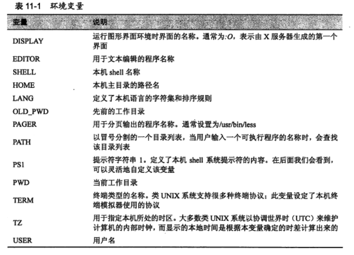

### VI简介

- 移动光标

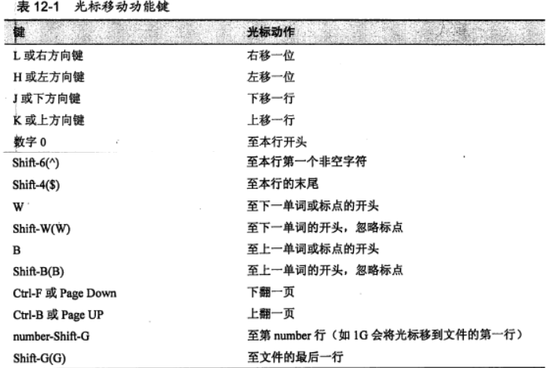

- VI插入一行

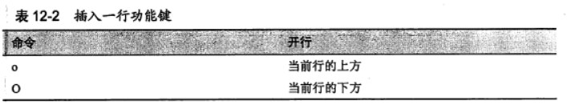

- 删除文本

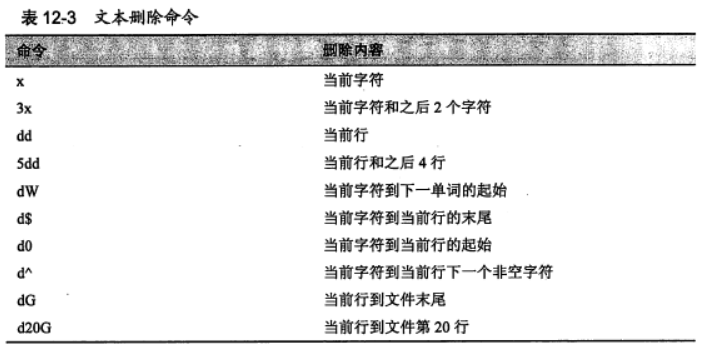

- 剪切、复制和粘贴文本

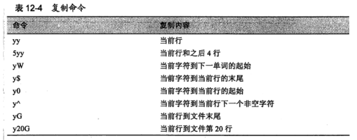

```
J   //与下一行合并为一行
f   //查找光标所在行的字符，如：fa，查找a字符
/abc   //全文查找abc单词
:%s/oldword/newword/g   //替换文件中的单词
:%s/oldword/newword/gc   //替换文件中的单词，替换前请求用户确认
:n   //切换到下一个文件
:n   //切换到上一个文件
:buffers  //查看正在编辑的文件列表
:buffers 1  //切换到文件列表的第一个文件
:e   //加载另一个文件，只能通过buffers命令切换文件
:r  1.txt   //将指定文件的内容插入到正在编辑的文件光标之前
ZZ   //保存当前文件并退出Vim
:wq   //保存当前文件并退出Vim
:w 2.txt   //将正在编辑的文件另存为2.txt，当前编辑仍是原文件
```

- VI替换确认功能键

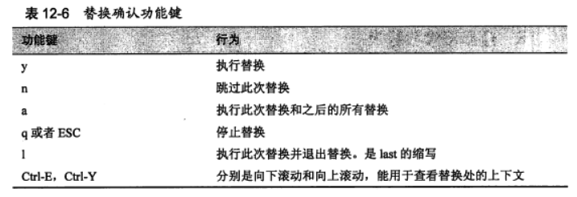

### 定制提示符

- 查看当前提示符格式
```
echo $PS1

PS1 = "\A\$ "   //自定义提示符，临时有效
export PS1   //保存提示符，永久有效
```
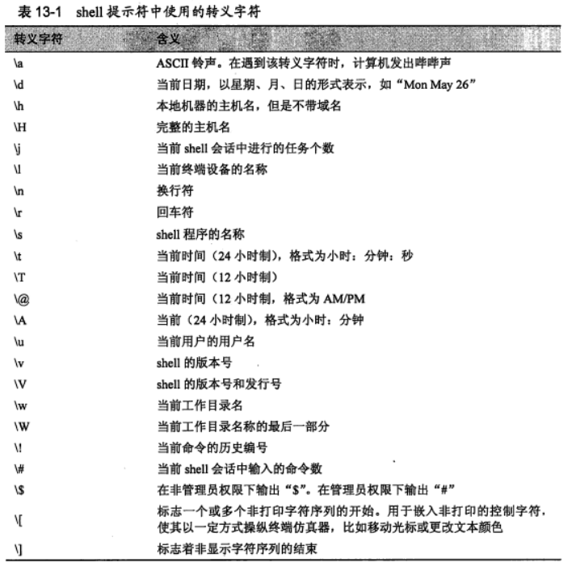

# 常见任务和主要工具

### 软件包管理

- 软件包安装命令
```
apt-get update;pat-get install package_name   //安装指定的软件
dpkg --install package_file   //安装软件包文件中的软件包
agt-get remove package_name   //移除软件包命令
apt-get update;apt-get upgrade   //更新库中的软件包
dpkg --list   //列出已安装的软件包列表
dpkg --status package-name   //判断软件包是否安装
apt-cache show package-name   //显示已安装软件包的相关信息
dpkg --search file_name   //查看某具体文件由哪个软件包安装得到
```

### 存储介质

- 查看已挂载的文件系统列表
```
mount

umount /dev/hdc   //卸载光盘

mkdir /mut/cdrom
mount -t iso9660 /dev/hdc /mut/cdrom     //挂载文件系统
```

> 快速设备向低速设备传送数据时，低速设备应该存在一个缓冲区，快速设备先将数据发送到缓冲区，再由低速设备慢慢从缓冲区读取数据，因此为确保全部数据写入低速设备，在移除低速设备前必须先卸载，防止数据丢失或文件损坏

- 磁盘分区
```
sudo umount /dev/sdb1  //卸载原来设备
sudo fdisk  /dev/sdb   //重新进行磁盘分区

sudo mkfs -t ext3 /dev/sdb1   //新建文件系统
```

- 测试、修复文件系统
```
sudo fsck /dev.sdb1
```

- 格式化软盘
```
sudo fdformat /dev/fd0
```

- md5认证
```
md5sum image.iso
```

### 网络

- 验证网络连接是否正常
```
ping 172.18.30.188
```

- 跟踪网络数据包的传输路径
```
traceroute 172.18.30.188
```

- 检查网络设置及相关统计数据
```
netstat -ie   //检查系统中的网络接口信息

netstat -r    //显示内核的网络路由表
```

- ftp传输文件
```
ftp fileserver   //连接fileserver文件服务器
Name:anonymous   //匿名服务器登录名
password：       //任意密码
```


- 非交互式网络下载工具
```
wget http://linuxcommand.org/index.php
```

- ssh远程连接
```
ssh remote-name   //连接远程主机remote-name   
exit   //断开远程连接
```

- ssh安全传输文件
```
scp remote-name:document.txt   //从远程主机上复制txt文档到本地系统当前工作目录
scp username@remote-name:document.txt  //远程主机用户名

sftp remote-name
```

### 文件搜索

- 较简单的方式查找文件
```
locate bin/zip   //查找bin文件夹下以zip开头的文件
locate zip | grep bin    //查找zip开头的文件，并且完整路径上包含bin字符
locate --regex 'bin/(bz|gz|zip)'  //正则表达式搜索文件
```
> locate命令搜索数据库是由updatedb程序生成的，多数系统为一天执行一次updatedb命令，所以locate搜索不到非常新的文件

- 较复杂的方式查找文件
```
find ~    //列出主目录的文件清单

find . -regex '^[A-Z]{,3}\.txt'   //利用正则表达式搜索

find ~ type d   //搜索主目录的文件夹 d表示文件夹，b表示块设备文件，c表示字符设备文件，f表示普通文件，l表示符号链接

find ~ -type f -name \*.JPG -size +1M    //大于1M的JPG文件

find ~ \(-type f -not -perm 0660 \) -or \(-type d -not -perm 0700\)   //判断主目录下是否所有的文件和子目录都有安全的访问权限

find ~ -print    //屏幕上列出主目录的文件清单

find ~ -type f -name 'foo*' -exec ls -l '{}' ';''   //-exec表示自定义搜索操作，{}表示当前路径，分号表示命令结束
```

- find搜索test选项

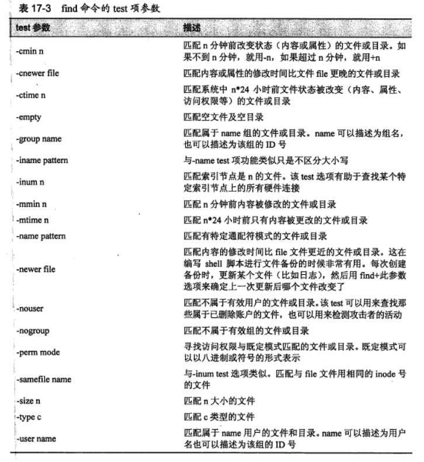

- find逻辑操作符

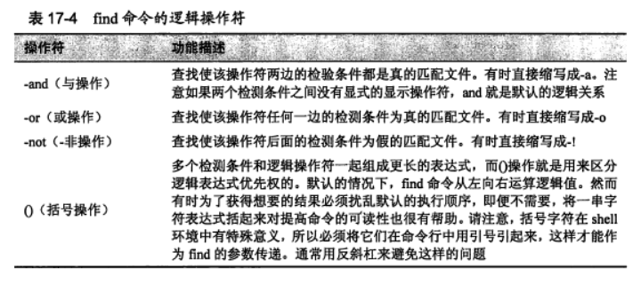

- find操作命令

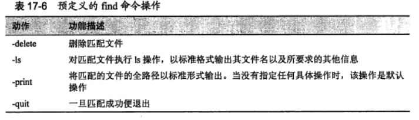

- find命令option选项(控制find命令的搜索范围)

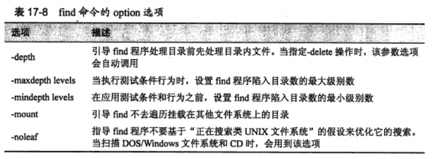

- 设定或更新文件的修改时间
```
touch filename   //将文件的修改时间设为当前时间
```

- 显示文件的所有属性
```
stat filename
```

### 归档与备份

- gzip文件压缩与解压缩
```
gzip foo.txt    //压缩后压缩文件取代原文件
gunzip foo.txt    //压缩文件还原为原文件

ls -l /etc | gzip > foo.txt.gz   //压缩目录
```

- gzip选项

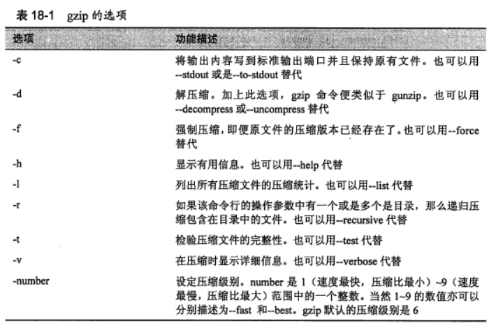

- bzip2牺牲速度以换取高质量的数据压缩
```
bzip2 foo.txt   //压缩
bunzip2 foo.txt   //解压缩

bzip2recover foo.txt  //恢复损坏的压缩文件
```

- tar磁带归档工具
```
tar mode[options] pathname   //不同的操作模式归档文件

如：tar cf playgroud.tar playground
```

- tar命令的操作模式

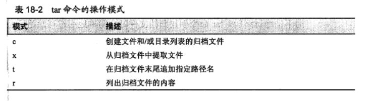

- zip打包压缩文件
```
zip options zipfile file...

zip -r playground.zip playground   //r表示递归压缩，没有r选项只压缩playground目录而不包含目录中的内容
unzip playground.zip  //解压
```

- 远程文件、目录的同步
```
rsync options source destination   //source表示本地文件，destination表示远程服务器文件

rsync -av playground foo   //a表示归档并保留文件属性，v表示在foo目录中生成了playground目录的镜像备份

sudo rsync -av --delete --rsh=ssh /etx /home usr/local romote-sys:backup   //将本地文件同步到远程主机上
```

### 正则表达式

- grep语法
```
grep [options] regex [file...]

grep -h '^zip' foo   //在foo文件夹中搜索zip开头的文件

zprep -E1 'regex|regular expression' *.gz   //对压缩文件进行搜索
```

- grep选项

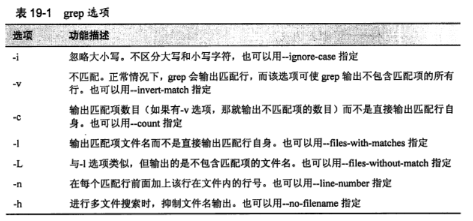

- 查看系统语言设置
```
echo $LANG
```

- POSIX字符类
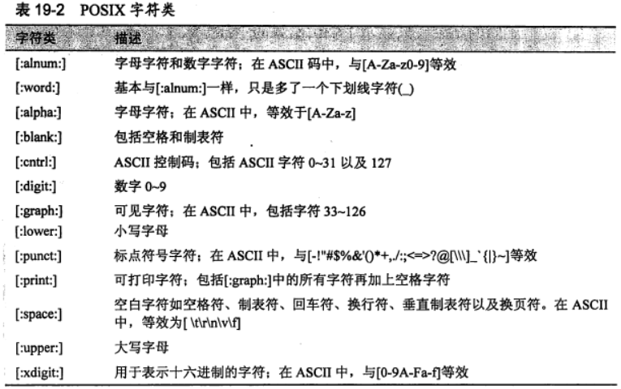

### 格式化输出

- 对行进行标号
```
nl distros.txt | head   //显示行号，head表示显示前10行
```

- nl命令选项

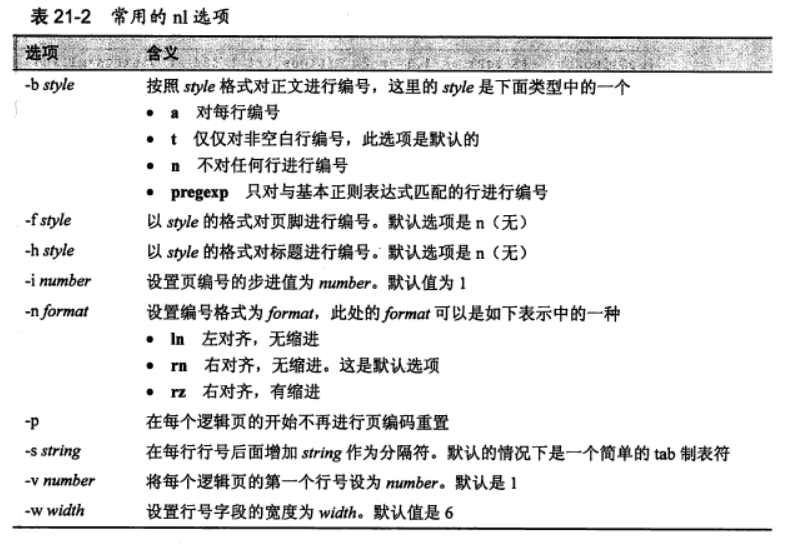

- 将文本中的行长度设定为指定长度
```
echo "aaaabbbbccccddddeeee" | fold -w 4    //以4个长度换行
```

- 简单的文本格式化工具
```
fmt -cw 10 fmt-info.txt | head
```

- fmt命令选项

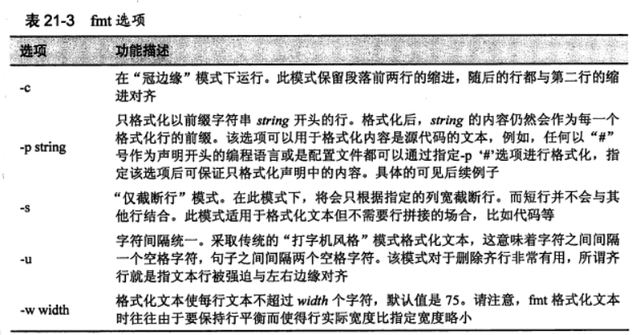

- 格式化打印文本
```
pr -l 15 -w 65 distres.txt   //用于给文本标页码
```

- 格式化并打印数据
```
printf "format" arguments

printf "I formatted the string: %s\n" foo   //类似于C语言的printf函数
```

- printf修饰符.png

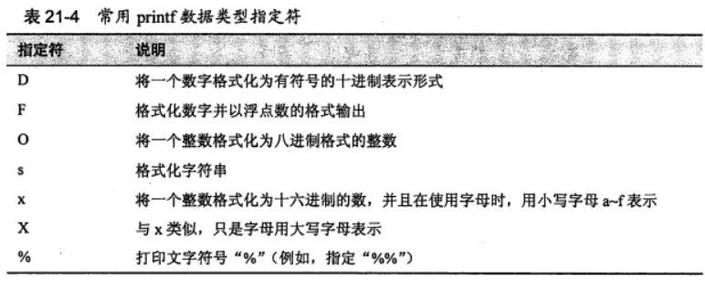

### 打印

- 将文本文件转换为打印文件
```
ls /usr/bin | pr -3 -w 65 | head  //生成文件夹下的目录列表打印文件
```

- 常见的pr选项

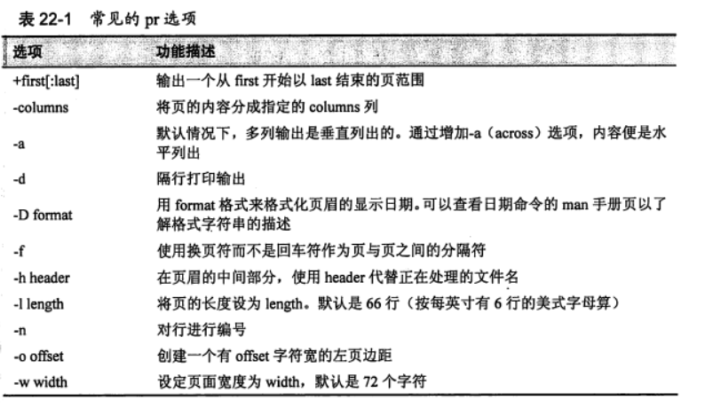

- lpr打印文件(Berkeley类型)
```
ls /usr/bin | pr -3 | lpr   //打印目录列表

lpr -P printer_name   //用指定打印机打印

lpstat -a    //查看系统打印机列表
lpstat -s   //查看打印系统配置详细描述
```

- lpstat选项

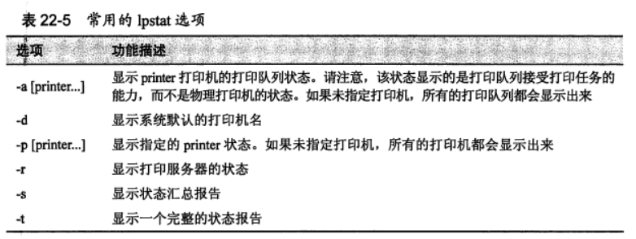

- lpr常用选项

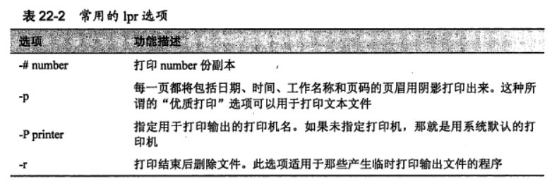

- lp打印文件(System V类型)
```
ls .usr/bin | pr -4 -w 90 -l 88 | lp -o page-left-36 -0 cpi=12 -o lpi=8   //生成目录清单，打印规格 为12CPI和8LPI，并且左边距为0.5英雨
```

- 显示打印队列状态
```
lpq
```

- 删除打印任务
```
cancel 603    //通过打印队列编号删除打印任务
```

# 编写shell脚本

###### 编写第一个shell脚本

```
vim shellbash   //编写shell脚本
chmod 755 shellbash  //赋予脚本可执行权限，755表示每个人可读可执行，700表示脚本所有人才可执行
./shellbash   //执行脚本

export PATH=~/bin:"$PATH"   //将bin文件夹添加到环境变量中
```

### 启动一个项目

- 变量赋值

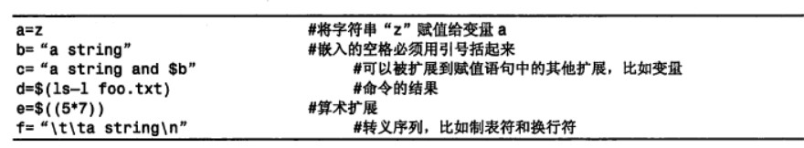

- here文档
```
foo="some text"   //定义一个变量
cat << _EOF_   //将_EOF_插入文本末尾，必须独占一行
#cat <<- _EOF_  //<<-表示忽略文本中的Tab字符，这样在shell中就可以使用缩进，提高脚本的可读性
"$foo"   //here文档可以将单双引号失去它们在shell文档中的特殊意义，也就可以打印出单双引号
'$foo'
\$foo   //文本末尾不能有空格
_EOF_   //必须独占一行
```

### 自顶向下设计

- shell函数
```
//函数定义必须在调用之前
方式一：
function name{
    commands
    return
}

方式二：
name(){
    commands
    return
}

函数调用一：
cat << _EOF_
$(name)
_EOF_

调用二：
name

```

### IF分支语句

```
if[$x = 5]; then
    echo "x equal 5."
else
    echo "x does not equal 5."
fi


语法：
if commands; then
    commands
[elif commands; then
    commands...]
[else
    commands]
fi

echo $?   //查看语句的返回代码，0表示执行成功，非0表示执行失败
```

- 测试文件的表达式

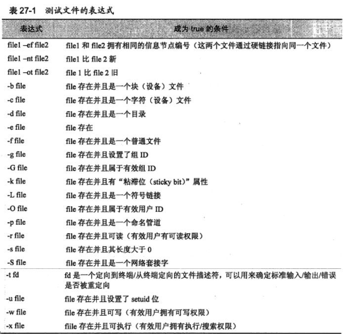

- 测试字符串表达式

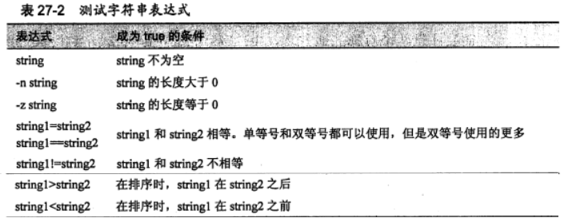

- 整数判断操作

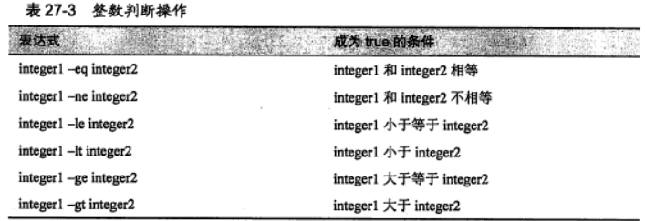

```
if [["$INT" =~ ^-?[0-9]+$]]; then   //判断正则表达式是否匹配
    echo "INT"
else
    echo "INT"
fi

if [[$FILE == foo.*]]; then
    echo "FILE"
fi
```

- 算术真值测试
```
if ((INT < 0)); then   //只能进行整数操作
    echo "INT"
fi
```

- 逻辑操作符

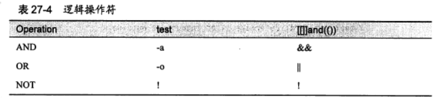

### 读取键盘输入

- 从标准输入读取输入值
```
read [-options][variable...]


read int1 int2 int3   //键盘输入int变量
echo $int1 $int2 $int3   //显示int变量
```

- read选项

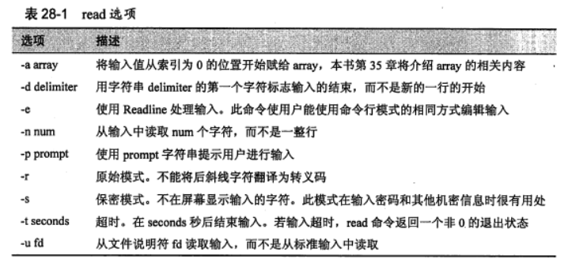

- IFS表示输入字符间隔，IFS=":"
- read不可重定向

### 循环控制流

- while循环
```
语法：while commands; do commands;done

while [$count -le 5]; do     //未达到条件退出循环
    if[$count -eq 3]; then
        continue
    fi
    if[$count -eq 2]; then
        break
    fi
    echo &count
    count=$((count + 1))
done
```

- until循环
```
until [$count -gt 5]; do     //达到条件退出循环
    echo $count
    count=$((count+1))
done
```

- 循环读取文件
```
while read distro version release; do
    printf "a:%s;b:%s;c:%s\n"  $distro $version $release
done < distros.txt
```

### case分支

```
//语法
case word in
   [patern [| pattern]...) commands ;;]...
esac


//示例
case $REPLY in
    0)  echo "hello a"   //模式匹配
        exit
        ;;
    1)  echo "hello b"
        uptime
        ;;
    2)  df -h
        ;;
    *)  echo "hello c"
        exit 1
        ;;
esac  
```
```
case $REPLY in
    0|2)  echo "hello a"   //模式匹配,0或者2匹配
        exit
        ;;
    3|4)  echo "hello b"
        uptime
        ;;
    5)  df -h
        ;;
    *)  echo "hello c"
        exit 1
        ;;
esac 
```

- case匹配模式

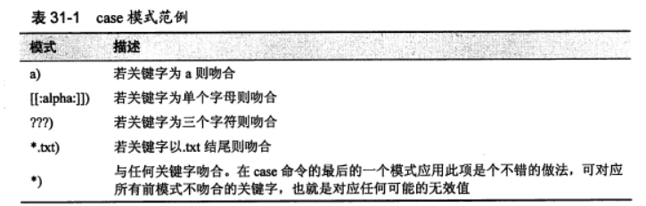


### 位置参数

```
$0~$9   表示脚本的第0到9个参数的值，%0表示脚本的路径
$#    表示脚本中参数的个数
${n}  表示脚本中第n个参数的值，如${20}
shift  滚动到下一个参数

while [[$# -gt 0]]; do
    echo "Argument $count=$1"  //每循环一次将下一个参数赋给$1,同时$#减1
    count=$((count+1))
    shift     //遍历所有脚本参数
done
```

- 特殊位置参数
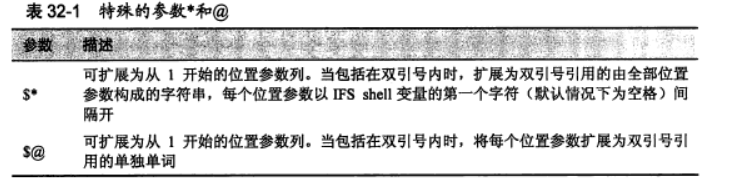

### for循环

```
//语法一
for variable [in words]; do
    commands
done

//语法二
for((i 0;i<5;i=i+1)); do
    echo $i
done

//示例
for i in A B C D; do
    echo $i
done

for i in {A..D}; do
    echo $i
done
```

### 字符串与数值

- 变量扩展
```
${parameter:-word}   //如果参数未被设定或是空参数，则其扩展为word的值，如果参数非空，则扩展为参数的值
${foo:- "hello"}

${parameter:=word}   //如果参数未被设定或为空，则其扩展为word的值，此外，word的值也将赋给参数，如果参数非空，则扩展为参数的值
${foo:= "hello"}

${parameter:?word}   //如果参数未被设定或为空,这样扩展会致使脚本出错而退出，并且word内容输出到标准错误，如果参数非空，则扩展结果为参数的值
${foo:? "hello"}

${parameter:+word}    //如果参数未被设定或为空，将不会产生任何扩展，或参数为空，word的值将取代参数的值，然而，参数的值并不发生变化

${#parameter}  //返回字符串的长度

${parameter:offset}  //截取除前offset个字符之外的字符
${parameter:5}

${parameter:offset:legth}  //截取除前offset个字符之外legth长度的字符
${parameter:5:2}

${parameter%pattern}    //返回匹配到的字符
${foo#*.}   //最短匹配
${foo##*.}   //最长匹配
```

- 数字进制

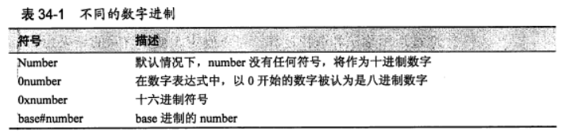

- 算术运算

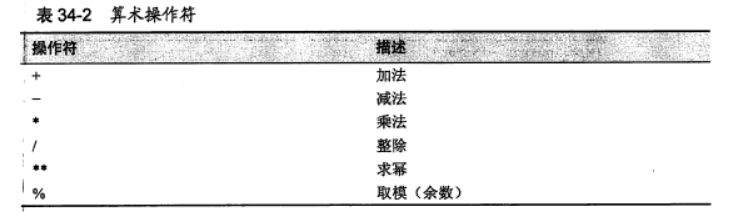

- 赋值操作符
- 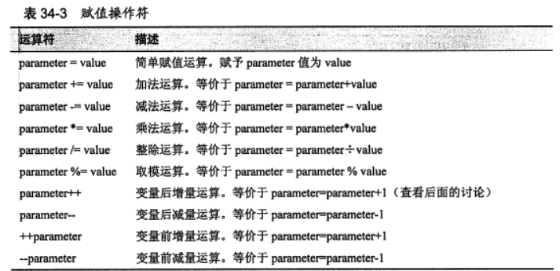

- 位操作
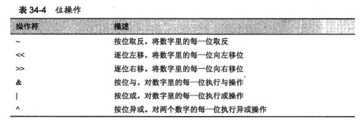
- 逻辑运算
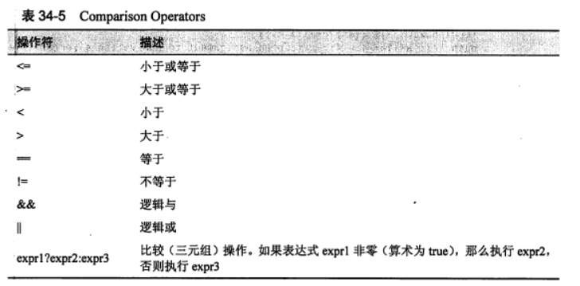

### 数组

```
name[subscript]=value

a[0] = foo0   //创建a数组并为第2个元素赋值
a[1] = foo1
a[2] = foo2
a[3] = foo3

declare -a a   //创建a数组
a=(value1 value2 value3)   //为数组赋多个值
a=([0]=value1 [2]=value2)  //为数组指定元素赋值
a+=(value4 value5 value6)  //为数组增加元素

${a[0]}   //获取一个元素值

for i in "${foo[@]}"; do   //遍历数组
    echo $i
done

a=(g d e p k t)
a_sorted=($(for i in "${a[@]}"; do echo $i; done | sort))   //数组排序
echo ${a_sorted[@]}

unset a   //删除数组
unset 'a[2]'  //删除数组的某个元素
```


### 其它命令

- 组命令
```
给命令在当前shell环境中运行
语法：
{
    commands1;
    commands2;
    commands3;
    ...
}

示例：
{ls -l;echo "hello"; cat foo.txt} > output.txt   //将三条命令的结果重定向到txt文档

{ls -l;echo "hello"; cat foo.txt} | lpr   //将三条命令的结果打印
```

- 子shell
```
子shell会将当前shell环境复制一份,然后在复制的环境中运行命令，子shell运行结束后，复制的环境变量消失。因此大部分情况下组命令更快，需要更少的内存
语法：
(
    commands1;
    commands2;
    commands3;
    ...
)
```


### 命名管道
```
mkfifo pipe1   //创建一个命名管道

ls -l > pipe1  //将结果输入到管道中，此时管道被阻塞
cat < pipe1   //将管道中的数据显示到屏幕
```