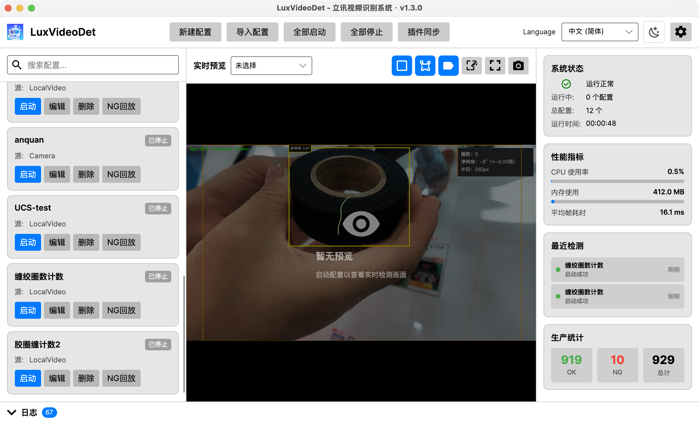

# LuxVideoDet

🎯 跨平台视频检测系统 - 基于 .NET 8.0 和 AI 推理引擎

[](https://dotnet.microsoft.com/)
[](https://github.com/yourusername/LuxVideoDet)

---

## 📖 简介

LuxVideoDet 是一个高性能、跨平台的视频检测系统，支持多种 AI 推理引擎和部署模式。适用于工业检测、安防监控、智能分析等场景。

### ✨ 核心特性

- 🚀 **多推理引擎**: ONNX Runtime (CPU/GPU/TensorRT/QNN) + OpenVINO
- 🎯 **多任务类型**: 目标检测、实例分割、姿态估计、旋转框检测、图像分类
- 🖥️ **三种运行模式**: Desktop (桌面端) / Web (Web端) / Headless (无头模式)
- 🌍 **完全跨平台**: Windows / Linux / macOS
- 📦 **容器化部署**: Docker / Kubernetes 支持
- 🔔 **多种通知方式**: Webhook / 企业微信 / 钉钉
- ⚡ **高性能**: 异步处理、批量推理、资源优化
- 🔌 **插件化与远程同步**: 算法插件独立 DLL 分发，支持通过 S3/MinIO 统一更新插件与模型

---

## 📷 应用截图



---

## 🎯 应用模式

LuxVideoDet 提供三种运行模式，满足不同场景需求：

| 模式 | 适用场景 | 特点 |
|------|---------|------|
| **Desktop** | 开发调试、单机部署 | Avalonia 跨平台图形界面、实时渲染、可视化配置 |
| **Web** | 多摄像头监控、远程访问 | Web 界面、视频流推送、RESTful API |
| **Headless** | 生产部署、无人值守 | 无界面、事件通知、资源消耗最低 |

详细说明请参考 [应用模式文档](docs/APPLICATION_MODES.md)

---

## 🚀 快速开始

### 前置要求

- [.NET 8.0 SDK](https://dotnet.microsoft.com/download/dotnet/8.0)
- Windows 10/11 或 Linux 或 macOS

### 安装步骤

```bash
# 1. 克隆项目
git clone https://github.com/yourusername/LuxVideoDet.git
cd LuxVideoDet

# 2. 还原依赖
dotnet restore

# 3. 构建项目
dotnet build -c Release

# 3.1 GPU 构建（CUDA，可选）
# 说明：需要 NVIDIA 驱动 + CUDA 运行环境；此参数会切换到 onnxruntime-gpu
dotnet build -c Release -p:UseCUDA=true

# 3.2 TensorRT 构建（可选，与 GPU 共用 Microsoft.ML.OnnxRuntime.Gpu）
# 说明：需要 NVIDIA 驱动 + CUDA + TensorRT；配置中 Device 选 TensorRT；build/run 均需 -p:UseTensorRT=true
# 选用 TensorRT 时不会自动回退到 CUDA/CPU，环境不对会直接报错，便于确认是否就绪；需要 CUDA 请用 Device=GPU
dotnet build -c Release -p:UseTensorRT=true

# 4. 运行（选择一种模式）
# Desktop 模式（桌面模式，跨平台）
dotnet run --project LuxVideoDet.Desktop

# 4.1 GPU 运行（CUDA）
# 关键：run 时同样要加 -p:UseCUDA=true，否则会按 CPU 依赖启动
dotnet run --project LuxVideoDet.Desktop -c Release -p:UseCUDA=true

# 4.2 TensorRT 运行（与 3.2 一致，需 -p:UseTensorRT=true）
dotnet run --project LuxVideoDet.Desktop -c Release -p:UseTensorRT=true

# （可选）Desktop 调试时输出 DBG 级别日志到文件与界面
# PowerShell: $env:LUXVIDEODET_LOG_LEVEL="Debug"; dotnet run --project LuxVideoDet.Desktop
# CMD:        set LUXVIDEODET_LOG_LEVEL=Debug && dotnet run --project LuxVideoDet.Desktop

# Web 模式（所有平台）
dotnet run --project LuxVideoDet.Web

# Headless 模式（所有平台）
dotnet run --project LuxVideoDet.Headless
```

#### Desktop 日志级别（DBG / Debug）

默认只写入 **Information** 及以上到 `logs/desktop-*.log` 与界面日志面板，避免高帧率推理时 DBG 刷屏占满磁盘。

需要 **Debug（DBG）** 时，在启动前设置环境变量：

- **`LUXVIDEODET_LOG_LEVEL`**（或 **`LUXVIDEODET_MIN_LOG_LEVEL`**，同义）
- 常用取值：`Debug`、`Verbose`（更细）、`Information`（默认行为）、`Warning`、`Error`

PowerShell 示例：`$env:LUXVIDEODET_LOG_LEVEL="Debug"; dotnet run --project LuxVideoDet.Desktop`

> 说明：检测主循环里已改为周期性 **Information** 性能日志，逐帧 `LogDebug` 已移除，因此即使开启 Debug，DBG 行数也会明显少于早期版本；若代码里某处仍调用 `LogDebug`，只有设置上述环境变量后才会出现在文件与界面中。

---

## 📦 系统要求

### Windows
- Windows 10/11 (x64)
- .NET 8.0 Runtime
- 可选: NVIDIA GPU + CUDA 12.x (GPU 加速)

### Linux
- Ubuntu 22.04 / Debian 12 / RHEL 9 或更高版本
- .NET 8.0 Runtime
- 系统依赖: `libopencv-dev`, `libgdiplus`
- 可选: NVIDIA GPU + CUDA Toolkit (GPU 加速)
- 可选: Qualcomm QNN SDK (NPU 加速，ARM64)

### macOS
- macOS 12 (Monterey) 或更高版本
- .NET 8.0 Runtime

详细安装指南请参考 [跨平台部署文档](docs/CROSS_PLATFORM_SETUP.md)

---

## 🏗️ 项目结构

```
LuxVideoDet/
├── LuxVideoDet.Core/          # 核心业务逻辑（跨平台）
│   ├── Algorithm/             # 检测算法
│   ├── Inference/             # 推理引擎 (ONNX/OpenVINO)
│   ├── Configuration/         # 配置管理
│   ├── Notification/          # 通知服务
│   └── ...
├── LuxVideoDet.Desktop/       # 桌面端应用 (Avalonia UI)
├── LuxVideoDet.Web/           # Web 应用 (ASP.NET Core)
├── LuxVideoDet.Headless/      # 无头模式 (Console)
├── tests/                     # 单元测试
└── docs/                      # 文档
```

详细架构说明请参考 [架构概览文档](docs/ARCHITECTURE_OVERVIEW.md)

---

## ⚙️ 配置示例

### 基础配置 (config.json)

```json
{
  "VideoSource": {
    "Type": "RTSP",
    "Url": "rtsp://192.168.1.100:554/stream",
    "FPS": 25
  },
  "Inference": {
    "Engine": "ONNX",
    "Device": "GPU",
    "ModelPath": "models/yolov8n.onnx",
    "ModelType": "Detection",
    "Classes": ["person", "car", "truck"],
    "ConfidenceThreshold": 0.5,
    "IouThreshold": 0.45
  },
  "Detection": {
    "Algorithm": "TearOffTab",
    "Regions": [
      {
        "Name": "检测区域1",
        "Points": [[100, 100], [500, 100], [500, 400], [100, 400]]
      }
    ]
  },
  "Notification": {
    "Enabled": true,
    "Notifiers": [
      {
        "Type": "Webhook",
        "WebhookUrl": "https://api.example.com/webhook",
        "Cooldown": 60
      }
    ]
  }
}
```

---

## 🔧 构建选项

### CPU 构建（默认）
```bash
dotnet build -c Release
```

### GPU 构建（CUDA）
```bash
dotnet build -c Release -p:UseCUDA=true
```

### GPU 运行（CUDA）
> 重要：`dotnet run` 也必须添加 `-p:UseCUDA=true`，否则默认走 CPU 包（onnxruntime）。

```bash
# Desktop
dotnet run --project LuxVideoDet.Desktop -c Release -p:UseCUDA=true

# Web
dotnet run --project LuxVideoDet.Web -c Release -p:UseCUDA=true

# Headless
dotnet run --project LuxVideoDet.Headless -c Release -p:UseCUDA=true
```

### NPU 构建（QNN，仅 Linux ARM64）
```bash
dotnet build -c Release -p:UseQNN=true \
    -p:QnnOrtSourceDir=/path/to/onnxruntime/capi \
    -p:QnnSdkLibDir=/path/to/qnn/lib
```

---

## 📤 部署（Windows x64 / AMD64）

在仓库根目录执行。运行时标识为 **`win-x64`**（适用于 64 位 Windows 10/11）。

| 模式 | 命令 |
|------|------|
| **Desktop**（自包含，目标机可不装 .NET 运行时） | `dotnet publish LuxVideoDet.Desktop -c Release -r win-x64 --self-contained` |
| **Web** | `dotnet publish LuxVideoDet.Web -c Release -r win-x64` |
| **Headless** | `dotnet publish LuxVideoDet.Headless -c Release -r win-x64 --self-contained` |

### GPU 打包（Windows, CUDA）
> 重要：发布/打包时也要加 `-p:UseCUDA=true`，否则产物仍是 CPU 版本依赖。

| 模式 | 命令 |
|------|------|
| **Desktop (GPU)** | `dotnet publish LuxVideoDet.Desktop -c Release -r win-x64 --self-contained -p:UseCUDA=true` |
| **Web (GPU)** | `dotnet publish LuxVideoDet.Web -c Release -r win-x64 -p:UseCUDA=true` |
| **Headless (GPU)** | `dotnet publish LuxVideoDet.Headless -c Release -r win-x64 --self-contained -p:UseCUDA=true` |

**Windows 输出目录**示例：`LuxVideoDet.<项目名>\bin\Release\net8.0\win-x64\publish\`。若目标机已安装 **.NET 8 运行时**，Desktop/Headless 可将 `--self-contained` 改为 `--self-contained false` 以减小体积。更细的桌面端说明见 [LuxVideoDet.Desktop/README.md](LuxVideoDet.Desktop/README.md)。

### macOS（Apple Silicon / Intel）

在 **Mac** 上于仓库根目录执行；按机器架构选择 **RID**：Apple Silicon 用 **`osx-arm64`**，Intel 用 **`osx-x64`**。桌面项目在 `publish` 成功后，还会在 **`LuxVideoDet.Desktop/bin/Release/LuxVideoDet.app`** 生成可直接拖入「应用程序」的 **`.app`**（程序坞图标依赖工程内 `Assets/macOS` 下的 `Info.plist` 与 `luxvideodet.icns`）。

| 模式 | 命令（示例：Apple Silicon） |
|------|-----------------------------|
| **Desktop**（自包含，并生成 `.app`） | `dotnet publish LuxVideoDet.Desktop -c Release -r osx-arm64 --self-contained -p:UseAppHost=true` |
| **Web** | `dotnet publish LuxVideoDet.Web -c Release -r osx-arm64` |
| **Headless**（自包含） | `dotnet publish LuxVideoDet.Headless -c Release -r osx-arm64 --self-contained` |

Intel Mac 将上表命令中的 `osx-arm64` 全部改为 `osx-x64`。若本机已安装 **.NET 8 运行时**，Desktop/Headless 可将 `--self-contained` 改为 `--self-contained false` 以减小体积。

### Linux（x64 / ARM64）

在 **Linux** 上于仓库根目录执行；按机器架构选择 **RID**：常见服务器用 **`linux-x64`**，ARM 设备用 **`linux-arm64`**。

| 模式 | 命令（示例：linux-x64） |
|------|--------------------------|
| **Desktop**（自包含） | `dotnet publish LuxVideoDet.Desktop -c Release -r linux-x64 --self-contained -p:UseAppHost=true` |
| **Web** | `dotnet publish LuxVideoDet.Web -c Release -r linux-x64` |
| **Headless**（自包含） | `dotnet publish LuxVideoDet.Headless -c Release -r linux-x64 --self-contained` |

ARM64 设备将上表命令中的 `linux-x64` 全部改为 `linux-arm64`。若目标机已安装 **.NET 8 运行时**，Desktop/Headless 可将 `--self-contained` 改为 `--self-contained false` 以减小体积。

---

## 🐳 Docker 部署

> ⚠️ **待实现** - Docker 部署功能正在规划中，暂不可用。

### 构建镜像（计划中）
```bash
docker build -t luxvideodet:latest .
```

### 运行容器（计划中）

**Headless 模式：**
```bash
docker run -d \
  --name luxvideodet \
  -v /path/to/config.json:/app/config.json \
  -v /path/to/models:/app/models \
  luxvideodet:latest
```

**Web 模式：**
```bash
docker run -d \
  --name luxvideodet-web \
  -p 5050:5050 \
  -v /path/to/config.json:/app/config.json \
  -v /path/to/models:/app/models \
  luxvideodet:latest
```

---

## 📊 性能指标

### 推理性能（YOLOv8n, 1080p@25fps）

| 硬件配置 | 推理引擎 | FPS | 推理延迟 | CPU 使用率 |
|---------|---------|-----|---------|-----------|
| Intel i7-12700 | ONNX (CPU) | 25-30 | 20ms | 35% |
| Intel i7-12700 | OpenVINO (CPU) | 25-30 | 15ms | 30% |
| NVIDIA RTX 3060 | ONNX (GPU) | 60+ | 8ms | 15% |
| Rockchip RK3588 | ONNX (QNN) | 25-30 | 18ms | 25% |

### 资源消耗（单摄像头）

| 模式 | 内存占用 | CPU 使用率 | GPU 使用率 |
|------|---------|-----------|-----------|
| Desktop | 800MB | 35-45% | 60-70% |
| Web | 600MB | 25-35% | 60-70% |
| Headless | 400MB | 15-25% | 60-70% |

---

## 🎓 使用示例

### Desktop 模式
1. 启动应用
2. 在界面中配置摄像头和检测参数
3. 点击"开始检测"
4. 实时查看检测结果

### Web 模式
1. 启动 Web 服务: `dotnet run --project LuxVideoDet.Web`
   - GPU 启动: `dotnet run --project LuxVideoDet.Web -c Release -p:UseCUDA=true`
2. 浏览器访问: `http://localhost:5050`
3. 在 Web 界面配置摄像头
4. 查看实时视频流和检测结果

### Headless 模式
1. 编辑配置文件: `config.json`
2. 启动服务: `dotnet run --project LuxVideoDet.Headless`
   - GPU 启动: `dotnet run --project LuxVideoDet.Headless -c Release -p:UseCUDA=true`
3. 检测结果通过 Webhook/企业微信通知
4. 查看日志: `logs/luxvideodet.log`

---

## 📚 文档

- **[产线交付与二次开发指南](docs/PRODUCTION_HANDOFF.md)** — 推荐给产线 IT：文档地图、**架构与主流程**、如何扩展业务算法、日志排查
- [应用模式说明](docs/APPLICATION_MODES.md) — 三种运行模式详解
- [架构概览](docs/ARCHITECTURE_OVERVIEW.md) — 模块划分（文内有勘误说明，示例代码请以当前源码为准）
- [跨平台部署指南](docs/CROSS_PLATFORM_SETUP.md) — Windows/Linux/macOS 部署
- [构建成功总结](docs/BUILD_SUCCESS_SUMMARY.md) — 构建和修复记录
- [变更日志](docs/changelog.md) — 版本功能增量与兼容性说明

---

## 🛠️ 技术栈

### 核心框架
- .NET 8.0
- C# 12

### AI 推理
- ONNX Runtime 1.24.2 (CPU/GPU/QNN)
- OpenVINO 2025.4.0

### 图像处理
- OpenCvSharp4 4.11.0
- SkiaSharp 3.119.2 (中文渲染)

### 依赖注入和配置
- Microsoft.Extensions.DependencyInjection
- Microsoft.Extensions.Configuration
- FluentValidation

### 日志系统
- Microsoft.Extensions.Logging
- Serilog

### Web 框架（Web 模式）
- ASP.NET Core 8.0
- SignalR (实时通信)
- Blazor Server (可选)

### 桌面框架（Desktop 模式）
- Avalonia UI 11.3 (.NET 8.0)

### 多任务渲染（扩展约定）

检测 / 实例分割 / 姿态 / OBB / 分类等 YOLO 输出形态不同，**预览与算法绘制需按 `ModelType` 选择策略**（框、掩膜、骨架、旋转多边形、概率条等）。  
统一入口与后续扩展方式见：**[LuxVideoDet.Core/Rendering/README.md](LuxVideoDet.Core/Rendering/README.md)**。

---

## 🤝 贡献

---

## 🙏 致谢

- [ONNX Runtime](https://onnxruntime.ai/) - 高性能推理引擎
- [OpenVINO](https://docs.openvino.ai/) - Intel 优化推理引擎
- [OpenCvSharp](https://github.com/shimat/opencvsharp) - OpenCV .NET 绑定
- [SkiaSharp](https://github.com/mono/SkiaSharp) - 跨平台 2D 图形库
- [Serilog](https://serilog.net/) - 结构化日志库

---

## 📞 联系方式
- 部门: 智能资讯发展平台
- 邮箱: Weiqian.Lai@luxshare-ict.com

---
