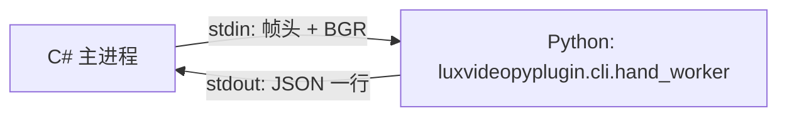

# 手部识别：C# 与 Python 集成（子进程 stdio）

本文档说明 **LuxVideoDet / .NET** 通过 **独立 Python 子进程** 运行 **luxvideopyplugin** 的 `hand_worker`，经 **stdin/stdout** 完成 MediaPipe Hand Landmarker 推理的路径。

**历史说明**：仓库曾提供 Python.NET 同进程嵌入（`hand_landmarker` / `mediapipe_hand`），已移除；当前 **仅维护子进程 stdio 路径**（`hand_landmarker_subprocess`）。Python 包由旧名 **mediapipa** 更名为 **luxvideopyplugin**；C# 配置项键名 **`mediapipa_venv`** 仍保留以兼容既有 JSON。

---

## 1. 原理概览

1. C# 启动 venv 内的解释器：`-u -m luxvideopyplugin.cli.hand_worker`。
2. 子进程就绪后 stdout 首行为 **`READY`**。
3. 每帧：C# 写入宽度、高度、stride 与像素 payload；读回一行 JSON，反序列化为 `HandLandmarkerFrameInferenceResult` 并做坐标映射（见 `HandLandmarkerCoordinates.cs`）。

---

## 2. Python 交付物（luxvideopyplugin）

| 模块 | 职责 |
|------|------|
| **`luxvideopyplugin.cli.hand_worker`** | 子进程入口：读帧、推理、输出 JSON（与 C# DTO 字段一致）。 |
| （包内 results / paths 等） | 结果结构与模型路径解析；以插件仓库 `hand_worker` 与 `docs/` 为准。 |

子进程环境变量（由 C# 传入时）包括：**`LUXVIDEO_VENV`**（venv 绝对路径，便于插件在 **pyplugin 根** 解析 `hand_landmarker.task`）、`LUXVIDEO_HAND_FRAME_DELTA_MS`、`LUXVIDEO_HAND_NUM_HANDS`；可选：`HAND_LANDMARKER_MODEL_PATH`、`LUXVIDEO_ROOT`。

---

## 3. C# 参考

| 位置 | 说明 |
|------|------|
| `LuxVideoDet.Core/Aoi/HandLandmark/README.md` | 运维与配置要点 |
| `HandLandmarkerSubprocessInferenceSession.cs` | 子进程生命周期与 `Detect` |
| `HandLandmarkerSubprocessAoiDetector.cs` | AOI 注册实现、`mediapipa_venv` 等参数 |
| `LuxVideoDet.Tests` → `HandLandmarkerSubprocessPureInferBench` | 可选：子进程纯推理耗时（需环境变量 `LUXVIDEODET_HAND_TEST_VENV`） |

---

## 4. 部署清单

| 项 | 说明 |
|----|------|
| **venv** | 已安装 **luxvideopyplugin**，且可执行 `python -m luxvideopyplugin.cli.hand_worker` |
| **模型** | `hand_landmarker.task`（默认路径或环境变量 `HAND_LANDMARKER_MODEL_PATH`） |
| **.NET** | 无需在主进程加载 Python.NET；手部仅依赖子进程 |

---

## 5. 修订记录

- **当前版**：**仅**子进程 stdio；已删除 Python.NET 同进程 `hand_landmarker` 及进程内嵌入推理会话。
- **包名迁移**：Python 侧 **mediapipa** → **luxvideopyplugin**；环境变量 **MEDIAPIPA_*** → **LUXVIDEO_***（见插件方文档）。
