#####编译系统
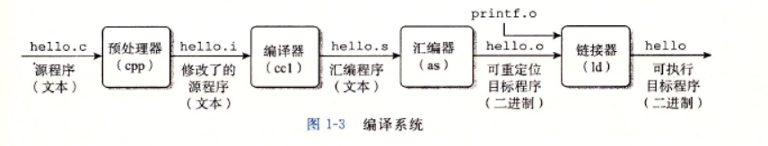

<br>

####系统硬件组成
#####总线
贯穿整个系统的是一组电子管道，称为总线，通常被设计成传送定长的字节块，也就是字，有4个字节(32位)或8个字节(64位)

#####IO设备
键盘、鼠标、显示器或磁盘等
每个IO设备都通过一个控制器或适配器与IO总线相连，控制器是IO设备本身或系统的主印制电路板(主板)上的芯片组，而适配器则是一块插在主板插槽上的卡，它们的功能都是在IO总线和IO设备之间传递信息

#####主存
主存是一个临时存储设备，由一级动态随机存取存储器芯片组成，逻辑上一个线性字节数组，每个字节有一个唯一的地址，这个地址从零开始

#####处理器
中央处理单元(CPU)，简称处理器，是解释或执行存储在主存中指令的引擎。处理器的核心是一个大小为一个字的存储存储设备(寄存器),称为程序计数器(PC),在任何时候，PC都指向主存中的某条机器语言指令(指令地址)
处理器按照指令集架构完成机器语言指令，指令集架构描述的是每条机器代码指令的效果，而微体系结构描述的是处理器实际上是如何实现的


<br>

#####从磁盘加载可执行文件到主存
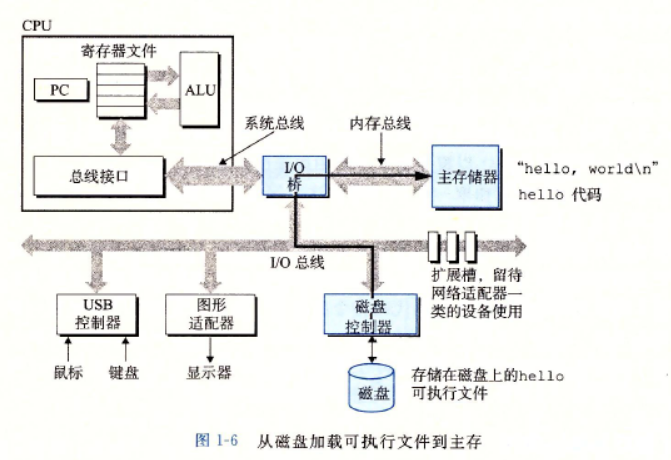

<br>

#####高速缓存
在处理器与主存之间，采用更小更快的存储设备，称为高速缓存存储器，它是一种静态随机访问存储器,高速缓存集成在CPU芯片上;其中存在和存储器数据同步问题，因此不是缓存越多越好，目前的设备存在三级缓存

<br>

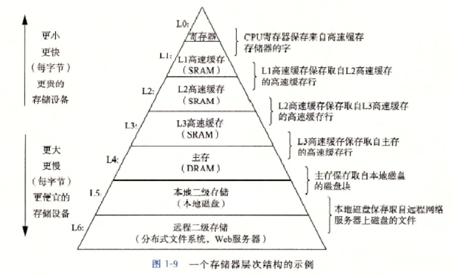


<br>

#####操作系统
操作系统两个功能：

- 防止硬件被失控的应用程序滥用
- 向应用程序提供简单一致的机制来控制复杂而又通常大不相同的低级硬件设备

>  文件是对IO设备的抽象表示，虚拟内存是对主存和磁盘IO设备的抽象表示，进程则是对处理器、内存和IO设备的抽象表示,虚拟机提供对整个计算机的抽象，包括操作系统、处理器和程序
>  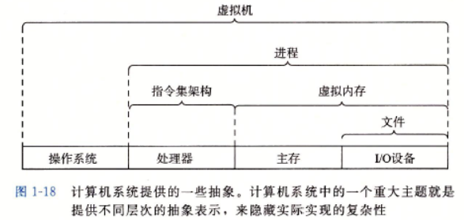

######上下文切换
一个<b>进程</b>的指令和另一个进程的指令是交错执行的(并发运行)，实现这种并发运行的机制称为上下文切换；针对多核处理器，不同核之前可能并行运行

操作系统保持跟踪进程运行所需的所有状态信息，这种状态也就是上下文，包括但不限于PC和寄存器文件的当前值以及主存的内容

当应用程序需要操作系统的某些操作时，比如读写文件，它就执行一条特殊的系统调用指令，将控制权传递给内核，然后内核执行被请求的操作并返回应用程序，内核是操作系统常驻主存的部分

<br>

#####程序运行所需内存空间
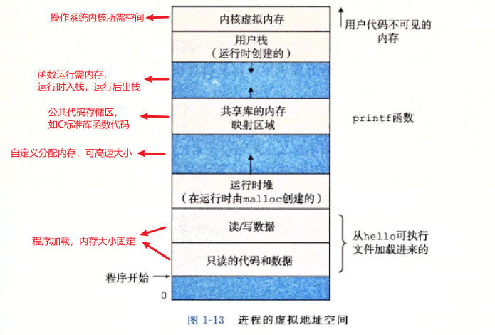

#####操作系统网络
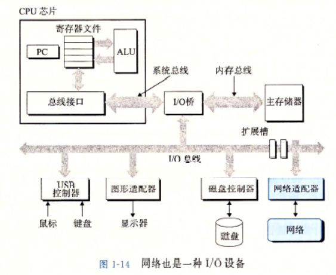

<hr>

#####多核处理器缓存
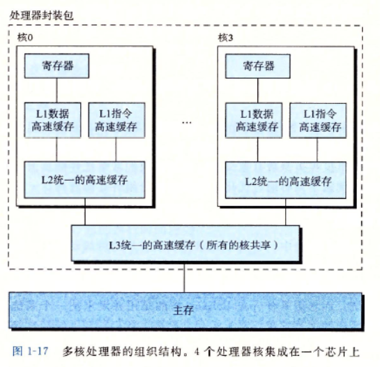

***超线程***，有时称为同时多线程，是一项允许一个CPU执行多个控制流的技术，如Intel Core i7处理器可以让每个核执行两个线程，所有一个4核的系统实际上可以并行地执行8个线程

如果处理器可以达到比一个周期一条指令更快的执行速率，就称之为***超标量处理器***，大多数现代处理器都支持超标量操作

在最低层次上，许多现代处理器拥有特殊的硬件，允许一条指令产生多个可以并行执行的操作，这种方式称为单指令、多操作，即***SIMD***并行

<hr>

#####编译步骤
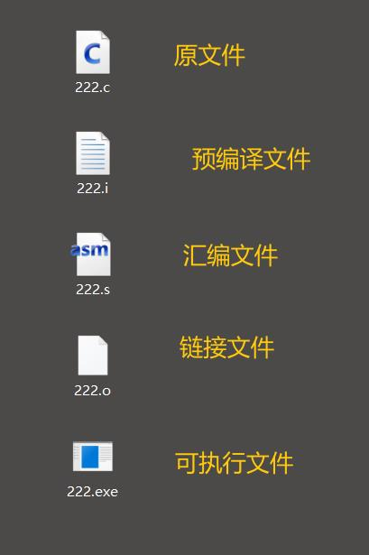

- 预编译指令(将标准库、头文件合并)
gcc -E main.c -o main.i
- 编译指令(生成汇编语言文件)
gcc -S main.i -o main.s
- 汇编指令(生成二进制文件)
gcc -c main.s -o main.o
- 链接指令(生成可执行文件)
gcc mian.o -o main


```
//C语言源文件
#include <stdio.h>
int main()
{
	printf("%s\n","hello world!");
	return 0;
}


//汇编语言文件
	.file	"222.c"
	.text
	.def	__main;	.scl	2;	.type	32;	.endef
	.section .rdata,"dr"
.LC0:
	.ascii "hello world!\0"
	.text
	.globl	main
	.def	main;	.scl	2;	.type	32;	.endef
	.seh_proc	main
main:
	pushq	%rbp
	.seh_pushreg	%rbp
	movq	%rsp, %rbp
	.seh_setframe	%rbp, 0
	subq	$32, %rsp
	.seh_stackalloc	32
	.seh_endprologue
	call	__main
	leaq	.LC0(%rip), %rcx
	call	puts
	movl	$0, %eax
	addq	$32, %rsp
	popq	%rbp
	ret
	.seh_endproc
	.ident	"GCC: (x86_64-win32-sjlj-rev0, Built by MinGW-W64 project) 8.1.0"
	.def	puts;	.scl	2;	.type	32;	.endef
```
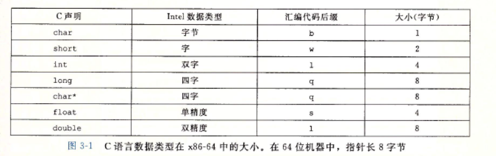

> - .align指令表示数据字节对齐，如: .aign 8表示数据对齐8个字节
> - rep指令可理解为占位符，不改变代码的行为，可以无视它们
> - %rbp是基指针，用于保存调用者的数据，函数返回时栈指针回到基指针位置
> - 栈溢出就是程序错误改动了程序之外的其它数据，当意外改动了基指针时，也就意味着函数返回到不可预料的位置，黑客可根据此机制使函数返回到指定的位置，从而插入一段破坏性代码，蠕虫就是此例
> - pushq指令表示应该将寄存器%rbp的内容压入程序栈中
 >> * q后缀表示移动8个字节的数据
 >> * 一个CPU包含一组通用目的寄存器，用来存储整数数据和指针，它们的名字以%r开头，每个寄存器都有特殊的用途,包括不限于通用寄存器、标志寄存器、指令寄存器、段寄存器、控制寄存器、调试寄存器、描述符寄存器、任务寄存器、MSR寄存器等
 >> * 寄存器名称及用途
	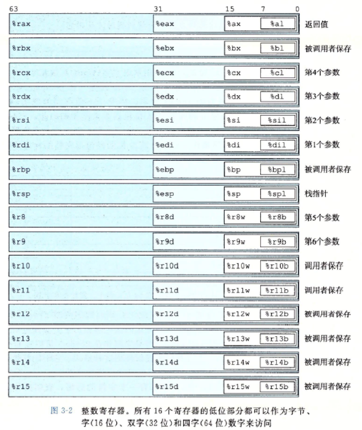
> - ret指令表示程序返回return
所有以"."开头的行都是汇编器和链接器工作的伪指令，我们通常可以忽略这些行
> - 以$开头的常数参数
寄存器作为参数表示用寄存器中低位的数据作为参数，低位数依据寄存器后缀确定
> - 寄存器寻址模式
 >> 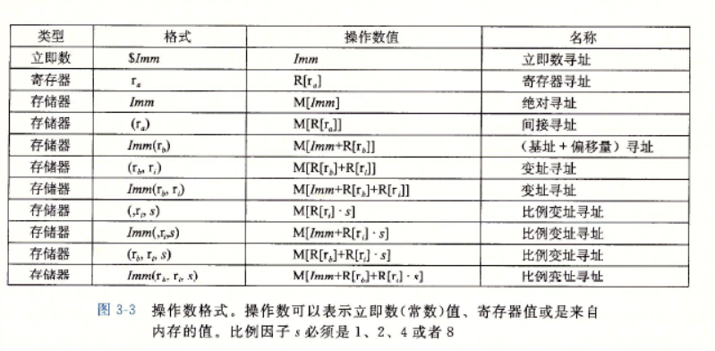
 >> 
 >> - 本书规定R[ra]表示寄存器a的值
 >> - 寻址模式Imm(rb,ri,s):一个立即数偏移，一个基址寄存器rb，一个变址寄存器ri和一个比例因子s，s必须是1、2、4、8，基址和变址寄存器必须是64位寄存器，有效地址被计算为Imm+R[rb]+R[ri]*s
 >> - 寄存器寻址示例
 >> -  
 >> 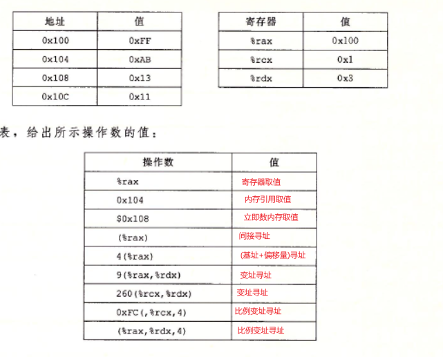
> - MOV类数据传送指令，这些指令把数据从源位置复制到目的位置,两个位置不能都是内存地址，从内存位置复制到另一个内存位置，应该先从内存复制到寄存器再从寄存器复制到另一个内存位置
 >> MOV类数据传送指令 
 >> 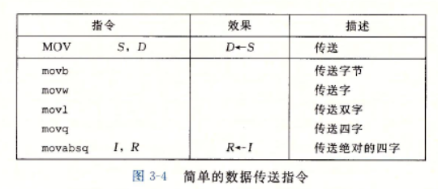
 >> 
 >> 扩展数据传递(小的数据类型复制到大的数据类型)
 >> 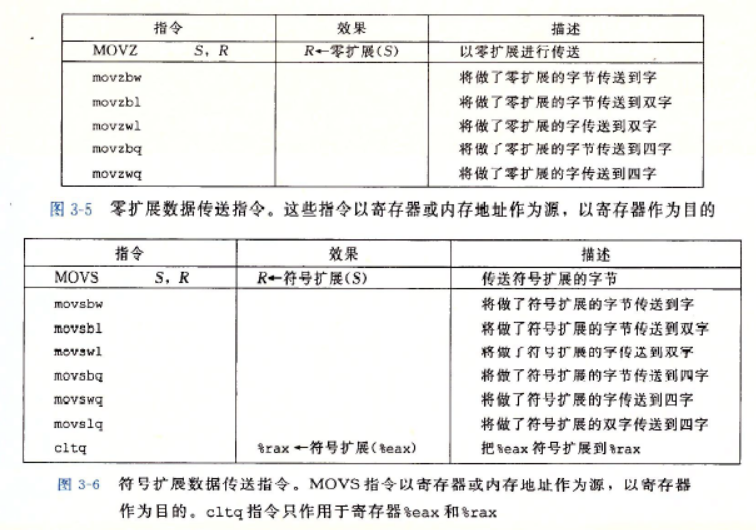
> - 指针就是地址，间接引用指针就是将该指针放在一个寄存器中，然后在内存中使用这个寄存器
> - 局部变量通常保存在寄存器中，而不是内存，访问寄存器比访问内存快得多
> - 压入和弹出栈数据
 > push指令把数据压入栈中，通过pop指令弹出栈，栈指针%rsp保存着栈顶元素的地址
 > 小端法，栈顶元素的地址是所有栈中元素地址中最低的
 > 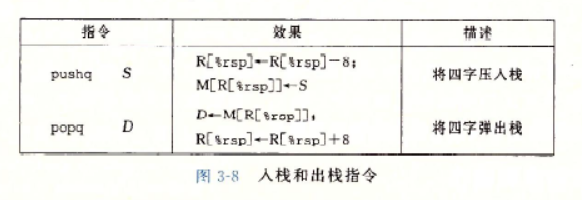
> - 算术和逻辑操作指令
 > 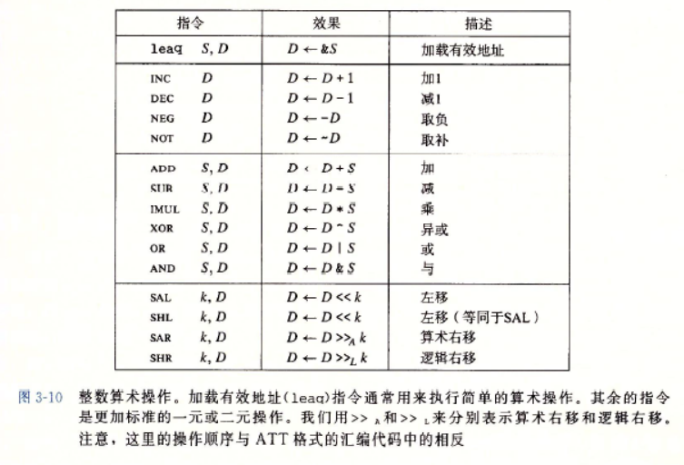
> - 特殊的算术操作(产生两个64位数字的全128位乘积以及整数除法的指令)
 > 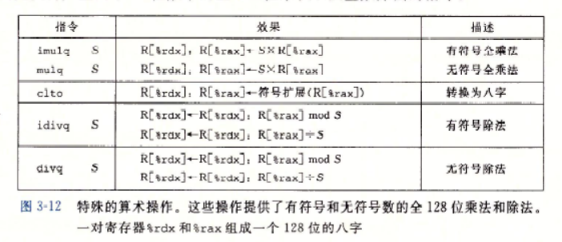
> - 条件码寄存器：描述最近的算术或逻辑操作的属性，可以检测这些寄存器来执行条码分支指令，只有1位大小
 >> * CF：进位标志，最近的操作使最高位产生了进位，可用来检查无符号操作的溢出
 >> * ZF:零标志，最近的操作得出的结果为0 ，当计算结果为0时将会被 设为1
 >> * SF：符号标志，最近的操作得到的结果为负数
 >> * OF：溢出标志，最近的操作导致一个补码溢出--正溢出或负溢出，0表示无溢出
> - CMP指令根据两个操作数之差来设置条件码；除了只设置条件码而不更新目的寄存器之外，CMP指令与SUB指令的行为是一样的
> - TEST指令的行为与AND指令一样，除了它们只设置条件码而不改变目的寄存器的值，典型的用法是，两个操作数是一样的，或其中的一个操作数是一个掩码，用来指示哪些应该被测试
 > - SET操作指令(设置条件码寄存器)
 > 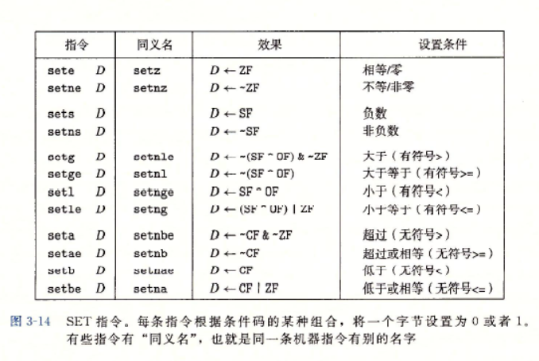
 > 
> 基于条件数据传送的代码会比基于条件控制转移的代码性能要好
> 跳转指令jump,导致执行切换到程序中一个全新的位置
 > jmp是无条件跳转,如直接跳转：jmp .L1   .L1:popq %rdx 直接跳转到出栈；如间接跳转：jmp *%rax ，即跳转目标是从寄存器或内存位置上读出的
 > 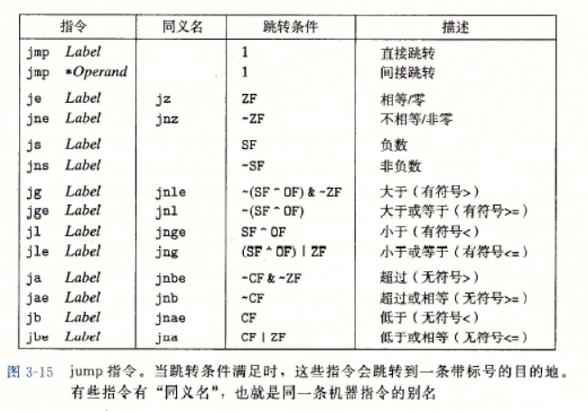

> - 条件数据传送指令.png
 > 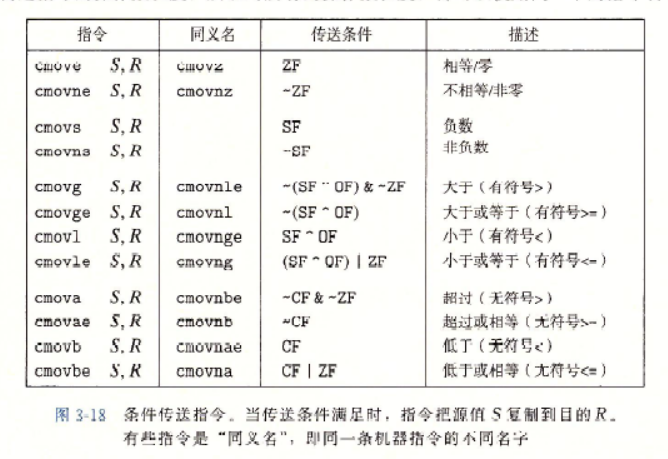
> call指令：指示过程P调用过程Q,该指令会把地址A压入栈中，并将PC设置为Q有起始地址，压入的地址A被称为返回地址，是紧跟在call指令后面那条指令的地址，对应的指令ret会从栈中弹出地址A，并把PC设置为A，指令参数是被调用过程起始的指令地址

#####过程调用
调用机制：

1. 传递控制：P调用Q，在调用过程Q之前，程序计数器要设置Q代码的起始位置，要返回Q后程序计数器要设置到过程P的后面那条指令的地址

2. 传递数据：P必须能够向Q提供一个或多个参数，Q必须能够向P返回一个值

3. 分配和释放内存：在开始时，Q可能需要为局部变量分配空间，而返回前，又必须释放这些存储空间

* 当过程需要的存储空间超出寄存器能存放的大小时，就会以在栈上分配空间，这部分称为过程的栈帧
* 通过寄存器，过程P可能传递最多6个整数值，但是如果Q需要更多的参数，P可能在调用Q之前在自己的栈帧里存储好这些参数；如果一个函数有大于6个整型参数，超出6个的部分就要通过栈来传递
* 6个过程数据传送寄存器及操作数大小
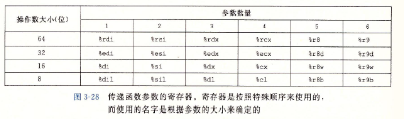

<br>

#####局部变量必须放在内存中的情况
1. 寄存器不足够存入所有的本地数据
2. 对一个局部变量使用地址运算符&，因此必须能够为它产生一个地址

某些局部变量是数组或结构，因此必须能够通过数组或结构引用被访问到

#####寄存器中的局部存储空间

- 必须确保当一个过程(调用者)调用另一个过程(被调用者)时，被调用者不会覆盖调用都稍后会使用的寄存器值，按照惯例，寄存器%rbx/%rbp/%r12...%r15被划分为被 调用都保存寄存器，必须保证这些寄存器的值在调用前和调用后是一样的，要么不改变它，要么把原始值压入然后改变寄存器的值然后返回前从栈中弹出原始值
- 所有其它寄存器，除了栈指针%rsp，都被称为调用者保存寄存器，任何函数都可能修改它们

######GDB命令
 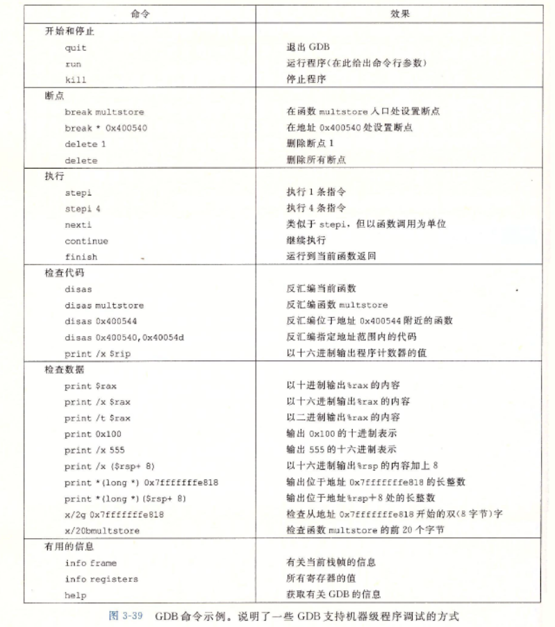

######内存越界及缓冲区溢出
程序错误的改写了程序之外的内存数据，导致程序运行错误或崩溃

- 栈随机化
	+ 操作系统使栈的位置在程序每次运行时都有变化，使攻击者无法定位基指针的地址
	+ 实现方式是在程序开始时，在栈上分配一段随机大小的空间，程序不使用但会改变后续栈的位置
	+ 这段空间太小会被攻击者遍历暴力破解，太大又会浪费内存空间
- 栈破坏检测
	+ 在栈帧中任何局部缓冲区与栈状态之间存储一个特殊的金丝雀值，也称为哨兵值，金丝雀值随机产生
	+ 在函数返回时检查金丝雀值是否改变，如果是则程序异常中止
- 限制可执行代码区域
	+ 消除攻击者向系统中插入可执行代码的能力
	+ 一种方法是限制哪些内存区域能够存放可执行代码，只有保存编译器产生的那部分内存才需要是可执行的，其他部分被限制为只允许读和写

######浮点代码

- 媒体寄存器

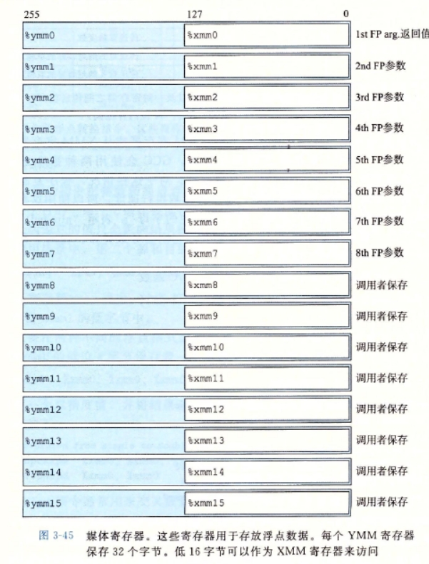

- 浮点传送指令

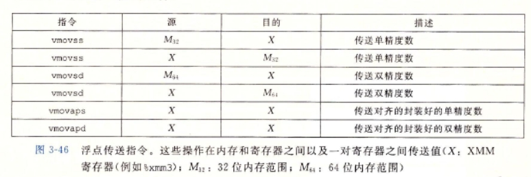

- 浮点转换指令

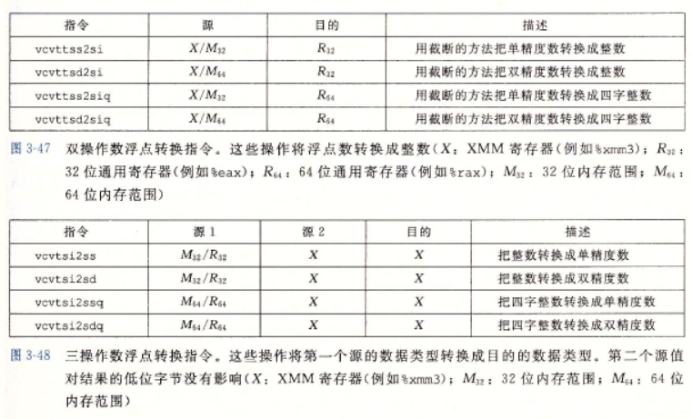

- 浮点运算操作

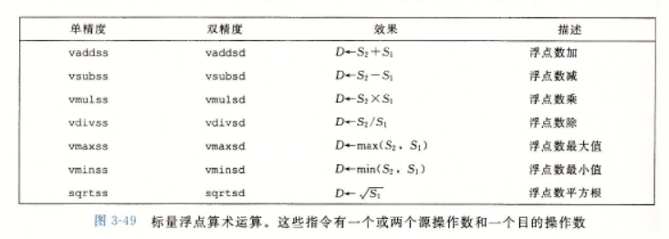


- 浮点位级操作

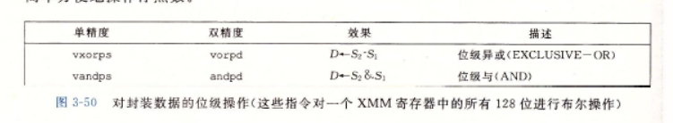